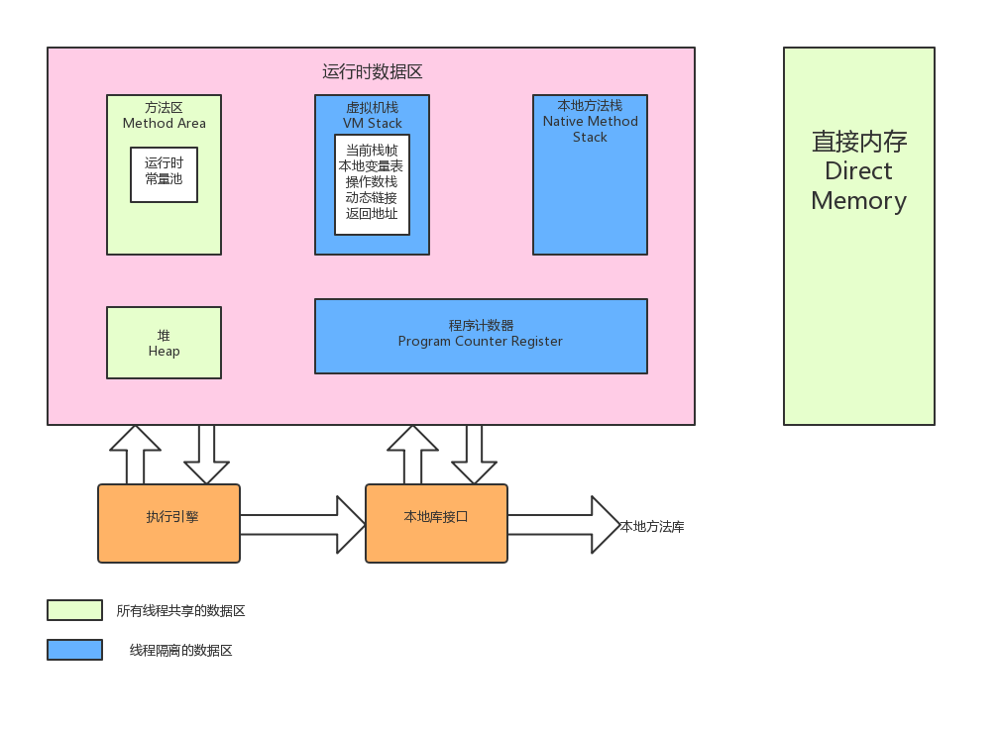

# JVM内存区域
## 运行时数据区域
Java虚拟机在执行Java程序的过程中会把它管理的内存划分成若干个不同的数据区域。

这些组成部分一些是线程私有的，其他的则是线程共享的。

### 程序计数器
程序计数器是一块较小的内存空间，可以看作是当前线程所执行的字节码的行号指示器。字节码解释器工作时通过改变这个计数器的值来选取下一条需要执行的字节码指令，分支、循环、跳转、异常处理、线程恢复等功能都需要依赖这个计数器来完。

另外，为了线程切换后能恢复到正确的执行位置，每条线程都需要有一个独立的程序计数器，各线程之间计数器互不影响，独立存储，我们称这类内存区域为“线程私有”的内存。

如果线程执行的是一个Java方法，这个计数器记录的是正在执行的虚拟机字节码指令的地址；如果执行的是Native方法，这个计数器值则为空(Undefined)。
此内存区域是唯一一个不会出现OutOfMemoryError的内存区域。

### Java虚拟机栈
与程序计数器一样，Java虚拟机栈也是线程私有的，它的生命周期和线程相同，描述的是 Java 方法执行的内存模型。

Java 内存可以粗糙的区分为堆内存(Heap)和栈内存(Stack),其中栈就是现在说的虚拟机栈，或者说是虚拟机栈中局部变量表部分。(实际上，Java虚拟机栈是由一个个栈帧组成，而每个栈帧中都拥有：局部变量表、操作数栈、动态链接、方法出口信息。)

局部变量表主要存放了编译器可知的各种数据类型(boolean、byte、char、short、int、float、long、double)、对象引用(reference类型，它不同于对象本身，可能是一个指向对象起始地址的引用指针，也可能是指向一个代表对象的句柄或其他与此对象相关的位置)。

Java 虚拟机栈会出现两种异常：StackOverFlowError 和 OutOfMemoryError。
* StackOverFlowError： 若 Java 虚拟机栈的内存大小不允许动态扩展，那么当线程请求栈的深度超过当前Java虚拟机栈的最大深度的时候，就抛出StackOverFlowError异常。
* OutOfMemoryError： 若 Java 虚拟机栈的内存大小允许动态扩展，且当线程请求栈时内存用完了，无法再动态扩展了，此时抛出OutOfMemoryError异常。

Java 虚拟机栈也是线程私有的，每个线程都有各自的Java虚拟机栈，而且随着线程的创建而创建，随着线程的死亡而死亡。