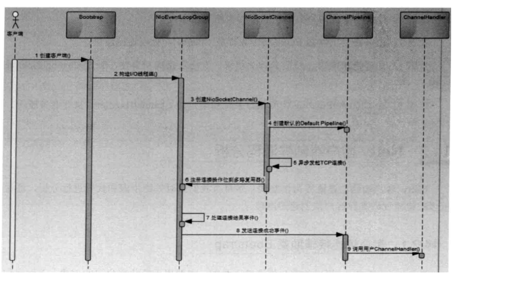

# Netty客户端学习

## Netty客户端创建步骤
Bootstrap是Socket客户端创建工具类，时序图如下：


下面学习netty客户端创建的关键步骤和原理
1. 用户线程创建Bootstrap,通过API设置创建客户端相关的参数，发起异步连接。
    ```
    Bootstrap b = new Bootstrap();
    ```
2. 创建处理客户端连接、IO读写的Reactor线程组NioEventLoopGroup
    ```
    EventLoopGroup group = new NioEventLoopGroup();
    ```
    可以通过构造函数指定I/O线程的个数，默认是CPU核数的两倍
3. 通过Bootstrap的ChannelFactory和用户指定的Channel类型创建用于客户端连接的NioSocketChannel
    ```
    b.group(group).channel(NioSocketChannel.class)
    ```
    此处的NioSocketChannel类似于Java NIO提供的SocketChannel。
4. 创建默认的channel Handler pipeline
    ```
    b.group(group)
    .channel(NioSocketChannel.class)
    .option(ChannelOption.TCP_NODELAY, true)
    .handler(new ChannelInitializer<SocketChannel>() {
        protected void initChannel(SocketChannel socketChannel) throws Exception {
            ChannelPipeline pipeline = socketChannel.pipeline();
            pipeline.addLast(new LineBasedFrameDecoder(1024))
                    .addLast(new StringDecoder())
                    .addLast(timeClientHandler);
        }
    });
    ```
    用于调度和执行网络事件。
5. 异步发起TCP连接
    ```
    ChannelFuture future = b.connect("localhost", 8888).sync();
    ```
    判断连接是否成功，如果成功，则直接将NioSocketChannel注册到多路复用器上，监听读操作位，用于数据报读取和消息发送，
    如果没有立即连接成功，则注册连接监听位，等待连接结果。
6. 注册对应的网络监听状态位到多路复用器
7. 由多路复用器在I/O中轮询个Channel，处理连接结果
8. 如果连接成功，设置Future结果，发送连接成功事件，触发ChannelPipeline执行
9. 由ChannelPipeline调度执行系统和用户的ChannelHandler，执行业务逻辑

## Netty客户端创建源码分析
   设置IO线程组:
   ```
   public B group(EventLoopGroup group) {
       if (group == null) {
           throw new NullPointerException("group");
       } else if (this.group != null) {
           throw new IllegalStateException("group set already");
       } else {
           this.group = group;
           return this.self();
       }
   }
   ```
   
   channel接口：
   ```
   public B channel(Class<? extends C> channelClass) {
       if (channelClass == null) {
           throw new NullPointerException("channelClass");
       } else {
           return this.channelFactory((io.netty.channel.ChannelFactory)(new ReflectiveChannelFactory(channelClass)));
       }
   }
   ```
   
   设置TCP参数：
   ```
   public <T> B option(ChannelOption<T> option, T value) {
       if (option == null) {
           throw new NullPointerException("option");
       } else {
           Map var3;
           if (value == null) {
               var3 = this.options;
               synchronized(this.options) {
                   this.options.remove(option);
               }
           } else {
               var3 = this.options;
               synchronized(this.options) {
                   this.options.put(option, value);
               }
           }

           return this.self();
       }
   }
   ```
   Netty提供的TCP主要参数如下：
   * SO_TIMEOUT: 控制读取操作将阻塞多少毫秒。如果返回值为0，计时器就被禁止了，该线程将无限阻塞
   * SO_SNDBUG: 套接字使用的发送缓冲区大小
   * SO_RCVBUG: 套接字使用的接收缓冲区大小
   * SO_REUSEADDR: 用于决定如果网络上仍然有数据向旧的ServerSocket传输数据，
   是否允许新的ServerSocket绑定到旧的ServerSocket同样的端口上。（该选项默认值与OS有关）
   * CONNECT_TIMEOUT_MILLIS: 客户端连接超时时间。
   * TCP_NODELAY: 决定是否使用nagle算法。如果是时延敏感型的应用，建议关闭nagle算法。
 
   设置handler接口：
   ```
   public final void channelRegistered(ChannelHandlerContext ctx) throws Exception {
       if (this.initChannel(ctx)) {
           ctx.pipeline().fireChannelRegistered();
           this.removeState(ctx);
       } else {
           ctx.fireChannelRegistered();
       }

   }
   ```   
   Netty提供了ChannelInitializer，当TCP链路注册成功之后，调用initChannel方法，设置用户ChannelHandler。
   ```
   .handler(new ChannelInitializer<SocketChannel>() {
               protected void initChannel(SocketChannel socketChannel) throws Exception {
                   ChannelPipeline pipeline = socketChannel.pipeline();
                   pipeline.addLast(new LineBasedFrameDecoder(1024))
                           .addLast(new StringDecoder())
                           .addLast(timeClientHandler);
               }
           });
   ```
   最后就是发起客户端连接:
   ```
   ChannelFuture future = b.connect("localhost", 8888).sync();
   ```
   
## 客户端连接操作
   首先要创建和初始化NioSocketChannel：
   ```
   private ChannelFuture doResolveAndConnect(final SocketAddress remoteAddress, final SocketAddress localAddress) {
       ChannelFuture regFuture = this.initAndRegister();
       final Channel channel = regFuture.channel();
       if (regFuture.isDone()) {
           return !regFuture.isSuccess() ? regFuture : this.doResolveAndConnect0(channel, remoteAddress, localAddress, channel.newPromise());
       } else {
           ...
       }
   }
   
   final ChannelFuture initAndRegister() {
       Channel channel = null;

       try {
           channel = this.channelFactory.newChannel();
           this.init(channel);
       } catch (Throwable var3) {
           if (channel != null) {
               channel.unsafe().closeForcibly();
               return (new DefaultChannelPromise(channel, GlobalEventExecutor.INSTANCE)).setFailure(var3);
           }

           return (new DefaultChannelPromise(new FailedChannel(), GlobalEventExecutor.INSTANCE)).setFailure(var3);
       }

       ChannelFuture regFuture = this.config().group().register(channel);
       if (regFuture.cause() != null) {
           if (channel.isRegistered()) {
               channel.close();
           } else {
               channel.unsafe().closeForcibly();
           }
       }

       return regFuture;
   }
   ```
   和服务端的创建初始化过程相似。
   
   然后发起异步连接操作。
   ```
   private static void doConnect(final SocketAddress remoteAddress, final SocketAddress localAddress, final ChannelPromise connectPromise) {
       final Channel channel = connectPromise.channel();
       channel.eventLoop().execute(new Runnable() {
           public void run() {
               if (localAddress == null) {
                   channel.connect(remoteAddress, connectPromise);
               } else {
                   channel.connect(remoteAddress, localAddress, connectPromise);
               }

               connectPromise.addListener(ChannelFutureListener.CLOSE_ON_FAILURE);
           }
       });
   }
   
   public ChannelFuture connect(final SocketAddress remoteAddress, final SocketAddress localAddress, final ChannelPromise promise) {
       if (remoteAddress == null) {
           throw new NullPointerException("remoteAddress");
       } else if (this.isNotValidPromise(promise, false)) {
           return promise;
       } else {
           final AbstractChannelHandlerContext next = this.findContextOutbound();
           EventExecutor executor = next.executor();
           if (executor.inEventLoop()) {
               next.invokeConnect(remoteAddress, localAddress, promise);
           } else {
               safeExecute(executor, new Runnable() {
                   public void run() {
                       next.invokeConnect(remoteAddress, localAddress, promise);
                   }
               }, promise, (Object)null);
           }

           return promise;
       }
   }
   ```
   需要注意的是，SocketChannel执行connect()后有三种结果
   * 连接成功，返回true
   * 暂时没有连接上，服务器没有返回ACK应答，连接结果不确定，返回false
   * 连接失败，直接抛出I/O异常
   
   如果是第二种结果，需要将NioSocketChannel中的selectionKey设置为OP_CONNECT，监听连接结果。
   
   异步连接返回之后，需要判断连接结果，如果连接成功，则出发channelActive事件:
   channelActive事件最终会将NioSocketChannel中的selectionKey设为selectionKey.OP_READ,用于监听网络读事件。
   
   如果没有立即连接上服务器，则将注册selectionKey.OP_CONNECT到多路复用器：
   ```
   protected boolean doConnect(SocketAddress remoteAddress, SocketAddress localAddress) throws Exception {
       if (localAddress != null) {
           this.doBind0(localAddress);
       }
    
       boolean success = false;
    
       boolean var5;
       try {
           boolean connected = SocketUtils.connect(this.javaChannel(), remoteAddress);
           if (!connected) {
               this.selectionKey().interestOps(8);
           }
    
           success = true;
           var5 = connected;
       } finally {
           if (!success) {
               this.doClose();
           }
    
       }
    
       return var5;
    }
   ```
   如果连接失败，则进入doClose()方法。
   
## 异步连接结果
   NioEventLoop的Selector轮询客户端连接Channel，当服务器返回握手应答后，对连接结果进行判断
   ```
   private void processSelectedKey(SelectionKey k, AbstractNioChannel ch) {
       ...
       int readyOps = k.readyOps();
       // We first need to call finishConnect() before try to trigger a read(...) or write(...) as otherwise
       // the NIO JDK channel implementation may throw a NotYetConnectedException.
       if ((readyOps & SelectionKey.OP_CONNECT) != 0) {
           // remove OP_CONNECT as otherwise Selector.select(..) will always return without blocking
           // See https://github.com/netty/netty/issues/924
           int ops = k.interestOps();
           ops &= ~SelectionKey.OP_CONNECT;
           k.interestOps(ops);

           unsafe.finishConnect();
       }

       // Process OP_WRITE first as we may be able to write some queued buffers and so free memory.
       if ((readyOps & SelectionKey.OP_WRITE) != 0) {
           // Call forceFlush which will also take care of clear the OP_WRITE once there is nothing left to write
           ch.unsafe().forceFlush();
       }

       // Also check for readOps of 0 to workaround possible JDK bug which may otherwise lead
       // to a spin loop
       if ((readyOps & (SelectionKey.OP_READ | SelectionKey.OP_ACCEPT)) != 0 || readyOps == 0) {
           unsafe.read();
       }
       ...
   }
   
   public final void finishConnect() {
       assert AbstractNioChannel.this.eventLoop().inEventLoop();

       try {
           boolean wasActive = AbstractNioChannel.this.isActive();
           AbstractNioChannel.this.doFinishConnect();
           this.fulfillConnectPromise(AbstractNioChannel.this.connectPromise, wasActive);
       ...
   }
   
   protected void doFinishConnect() throws Exception {
       if (!this.javaChannel().finishConnect()) {
           throw new Error();
       }
   }
   ```
   
   连接成功之后，调用fulfillConnectPromise方法，触发链路ChannelActive事件
   ```
   private void fulfillConnectPromise(ChannelPromise promise, boolean wasActive) {
       if (promise != null) {
           boolean active = AbstractNioChannel.this.isActive();
           boolean promiseSet = promise.trySuccess();
           if (!wasActive && active) {
               AbstractNioChannel.this.pipeline().fireChannelActive();
           }

           if (!promiseSet) {
               this.close(this.voidPromise());
           }

       }
   }
   ```
   
## 客户端连接超时机制
   JDK原生的Nio没有超时机制，netty利用定时器提供了客户端连接超时控制功能。
   
   首先，在创建客户端的时候可以通过CONNECT_TIMEOUT_MILLIS设置连接超时时间
   ```
   option(ChannelOption.CONNECT_TIMEOUT_MILLIS, 3000)
   ```
   发起连接的同时，启动连接超时检测定时器。
   ```
   int connectTimeoutMillis = AbstractNioChannel.this.config().getConnectTimeoutMillis();
   if (connectTimeoutMillis > 0) {
       AbstractNioChannel.this.connectTimeoutFuture = AbstractNioChannel.this.eventLoop().schedule(new Runnable() {
           public void run() {
               ChannelPromise connectPromise = AbstractNioChannel.this.connectPromise;
               ConnectTimeoutException cause = new ConnectTimeoutException("connection timed out: " + remoteAddress);
               if (connectPromise != null && connectPromise.tryFailure(cause)) {
                   AbstractNioUnsafe.this.close(AbstractNioUnsafe.this.voidPromise());
               }

           }
       }, (long)connectTimeoutMillis, TimeUnit.MILLISECONDS);
   }
   ```
   如果在连接超时之前获取到连接结果，则删除连接超时定时器
   ```
   public final void finishConnect() {
       ...
       } finally {
           if (AbstractNioChannel.this.connectTimeoutFuture != null) {
               AbstractNioChannel.this.connectTimeoutFuture.cancel(false);
           }

           AbstractNioChannel.this.connectPromise = null;
       }

   }
   ```
   无论连接是否成功，只要获取到连接结果，则删除连接超时定时器。
   