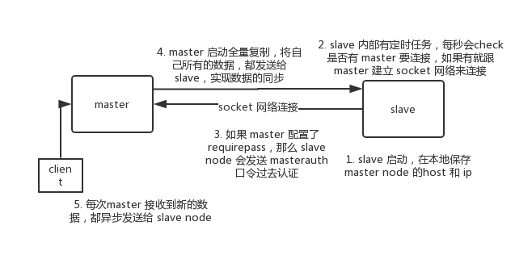

# Redis主从架构
单机Redis承载的QPS有几万。Redis 支持简单且易用的主从复制（master-slave replication）功能，
一主多从，主负责写，并将数据复制到从节点，从负责读，所有的读请求走从节点。
## Redis replication
Redis异步地复制数据到从节点，不过 Redis2.8 开始，从节点会周期性地确认自己每次复制的数据量。 
* 一个主服务器可以有多个从服务器
* 从服务器也可以有自己的从服务器，多个从服务器之间可以构成一个图状结构
* 复制功能不会阻塞主服务器，即使有一个或多个从服务器正在进行初次同步，主服务器也可以继续处理命令请求
* 从服务器复制的时候也不会阻塞对自己的查询请求，它会用旧的数据集来完成请求，不过当复制完成，需要删除旧数据集，加载新数据集，这时就会暂停服务

如果开启了主从架构，那么必须开启主节点的持久化，不能将从节点作为主节点的备份。如果主节点未开启持久化，可能主节点在宕机后重启数据是空的，
然后经过复制，从节点数据也丢了。

另外还需要做主节点的备份，万一本地持久化文件丢失，可以从备份中挑选一个恢复主节点。
## Redis 主从复制
当从节点启动时，会发送一个 PSYNC 命令给主节点。

如果这是从节点初次连接，那么会触发一次 full resynchronization 全量复制。此时主节点会启动一个后台线程，开始生成一份 RDB 快照，同时将收到的写命令缓存起来。
RDB 文件生成后，主节点会将此文件发送给从节点，从节点会先写入磁盘，然后再从磁盘加载到内存，接着主节点会将缓存的写命令发送给从节点，从节点同步这些数据。

从节点如果跟主节点有网络故障，断开了连接，会自动重连，连接之后主节点仅会复制缺少的数据给从节点。


## 主从复制的断点续传
Redis2.8 开始支持主从复制的断点续传，如果主从复制过程中，网络连接断掉了，那么可以接着上次复制的地方，继续复制下去，而不是从头开始复制一份。

主节点会在内存维护一个backlog，主从节点都会保存一个replica offset和一个master run id，offset 就是保存在 backlog 中的。
如果主从节点网络连接断掉了，主节点会从replica offset开始复制，如果没有replica offset，那么会执行 full resynchronization。

## 无磁盘化复制
主节点可以再内存中直接创建 RDB，然后发送给从节点。见配置文件
```
# With slow disks and fast (large bandwidth) networks, diskless replication
# works better.
repl-diskless-sync no
# 等待 5s 后再开始复制，因为要等更多 slave 重新连接过来
repl-diskless-sync-delay 5
```
## 过期 key 处理
从节点不会过期 key，只会等待主节点过期 key。如果主节点过期了一个 key，或者通过 LRU 淘汰了一个 key，那么会模拟一条 del 命令发送给 从节点。
## 复制的完整流程
从节点启动时，会在本地保存主节点的信息，比如主节点的host和ip。

从节点内部有一个定时任务，每秒检查是否有新的主节点要连接和复制，如果有，就跟主节点建立socket连接。然后发送ping命令给主节点。
如果主节点设置了requirepass，那么从节点必须发送masterauth的口令认证。主节点第一次执行 full resynchronization，将所有数据发送给从节点，
后续会将写命令异步复制给从节点。


## 全量复制
* 主节点执行 bgsave，生成一份 rdb 文件
* 主节点将 rdb 文件发送给从节点，如果 rdb 文件复制时间超过60s，那么从节点会认为复制失败，可以调整这个参数
* 主节点生成 rdb 时，同时将收到的写命令缓存起来，再从节点保存了 rdb 之后，再将缓存的写命令复制给从节点
* 如果在复制期间，内存缓冲区持续消耗超过 64MB，或者一次性超过 256MB，那么停止复制，复制失败
```
client-output-buffer-limit slave 256mb 64mb 60
```
* 从节点收到 rdb 文件后，清空自己的旧数据，然后重新加载 rdb 到自己的内存，同时使用旧的数据对外提供服务
* 如果从节点开启了 AOF ，将立即执行 BGREWRITEAOF，重写 AOF

## 增量复制
* 如果全量复制过程中，主从节点网络连接断掉，那么从节点重新连接主节点时，会触发增量复制
* 主节点直接从自己的backlog中获取部分丢失的数据，发送给从节点，默认backlog就是1MB
* 主节点是根据从节点发送的psync中的offset在backlog中获取数据的

## 心跳
主从节点之间会互相发送心跳信息。主节点每隔10s发送一次心跳，从节点每隔1s发送一次心跳

## 异步复制
主节点每次接收到写命令后，先在内部写入，然后异步发送给从节点