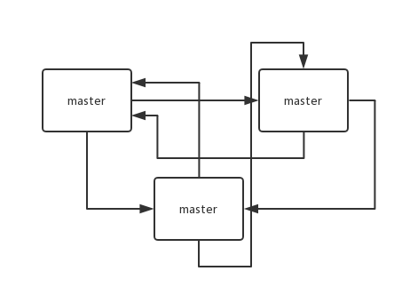
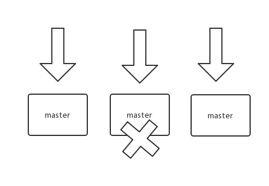

# Redis 集群模式
Redis cluster，主要是针对海量数据+高并发+高可用的场景。Redis cluster可以支持多个 Redis master，每个 Redis master 可以配置多个 Redis slave。
由此Redis可以做到横向扩容，如果你要支撑更大数据量的缓存，那就横向扩容更多的 master 节点。
## Redis cluster介绍
* 数据自动分片，每个 master 放部分数据
* 部分 master 不可用时，整个集群还是可以继续工作的

Redis cluster模式，需要开启两个端口号，比如一个是 6379，另外一个就是 加1w 的端口号，比如 16379。

16379是用于节点间通信的，也就是cluster bus的通信，用来进行故障检测、配置更新、故障转移授权。cluster bus用了一种二进制协议——gossip协议，
用于节点间高效的数据交换，占用更少的带宽和处理时间。

## 节点间通信机制
集群元数据维护有两种方式：集中式和gossip协议。

集中式是将集群元数据存储在某个节点上。一个典型代表，就是大数据领域的 storm。它是分布式的大数据实时计算引擎，采用集中式的方式维护集群元数据。
底层采用zookeeper对所有元数据进行维护。

Redis cluster采用另外一种方式，gossip协议维护集群元数据。所有节点持有一份元数据，不同的节点如果发生了元数据的变更，就不断将元数据发送给其他节点，让其他节点也进行元数据的变更。

集中式的好处在于，元数据的读取和更新非常高效，一旦元数据出现了变更，就立即更新到集中式的存储中，其它节点读取的时候就可以感知到；
不好的地方在于，所有元数据的写请求全部集中在一个地方，可能导致元数据的存储有压力。

gossip好处在于，元数据的存储比较分散，所以写请求会分散到各个节点，降低了压力；不好在于，元数据的更新有延迟。

节点之间交换的信息包括故障信息、节点的增加和删除、hash slot信息等等。
### gossip协议
gossip协议包含多种消息，ping、pong、meet、fail等等。
* meet：某个节点发送meet给新加入的节点，让新节点加入集群中，然后新节点可以开始跟其他节点通信
* ping：每个节点都会频繁地向其他节点发送ping，其中包含自己的状态还有自己维护的集群元数据，互相通过ping交换元数据
* pong：返回ping和meet，包含自己的状态和其他信息，也用于信息广播和更新
* fail：某个节点判断另一个节点fail之后，就发送fail给其他节点，通知其他节点：有个节点宕机了
### 深入理解ping
ping时需要携带一些元数据，如果过于频繁，将会使网络压力过重。

每个节点每秒会执行10此ping，每次会选择5个最久没有通信的其他节点。当然如果发现某个节点通信延时达到了 cluster_node_timeout / 2，那么立即发送 ping，避免数据交换延时过长。
比如说，两个节点之间10分钟没有交换数据了，那么整个集群就处于严重的元数据不一致的情况。所以可以调节 cluster_node_timeout ，如果调得比较大，那么会降低 ping 的频率。

每次ping都会带上自己的节点信息，还有1/10其他节点的信息，发送出去，进行交换。至少包含3个其他节点的信息，至多包含 总节点数目-2 个其他节点的信息。

## 分布式寻址算法
* hash算法（大量缓存重建）
* 一致性hash算法（自动缓存迁移） + 虚拟节点（负载均衡）
* Redis cluster 的 hash slot算法

### hash算法
首先对key计算hash值，然后对节点数取模，就会落在不同的 master 上。一旦某个 master 宕机，所有的请求过来，都会基于最新的剩余 master 节点数去取模，尝试去取数据。
这会导致大量请求拿不到有效缓存，直接打在数据库上。

###一致性hash算法

### Redis cluster 的 hash slot 算法
Redis cluster 有固定16384(2^14)个hash slot，对每个key进行CRC16值，然后对16384取模，可以获取到该key对应的slot。

Redis cluster 中每个 master 都持有部分 slot，比如有3个 master，那么可能每个 master 持有5000多个slot。
hash slot使得节点的增加和删除很简单，增加一个 master，就将其他 master 的hash slot分一点过去，减少一个 master，就将它的hash slot分给其他 master。
移动hash slot的成本很低。客户端的 api，可以对指定的数据，让他们走同一个 hash slot，通过 hash tag 来实现。

任何一个节点宕机，不影响其他节点，因为key找的使hash slot，不是具体物理机。

## Redis cluster 的高可用与主备切换原理
Redis cluster 的高可用跟哨兵模式差不多。
### 判断节点宕机
如果一个节点认为另一个节点宕机，就是pfail，主观宕机；如果多个节点都认为另外一个节点宕机了，那么就是 fail，客观宕机。跟哨兵几乎一样~

在 cluster-node-timeout 内，如果某个节点一直没有返回pong，那么就会被认为pfail。

如果一个节点认为其他节点pfail，就会在gossip的ping消息里，将失败信息发送给其他节点，如果超过半数节点都认为该节点pfail，那么这个节点就变成fail。
### 从节点过滤
对于宕机的 master，从其所有的 slave，选择一个成为 master。

检测每个 slave 与 master 断开连接的时间，如果超过了 cluster-node-timeout * cluster-slave-validity-factor，那么就没有资格成为 master。
### 从节点选举
每个从节点，都会根据自己对 master 的 replica offset，来设置一个选举时间，replica offset （复制数据越多）越大，选举时间越靠前，优先进行选举。

所有的 master 要给进行选举的 slave 投票，超过半数的 master 都投票了某个 slave，那么选举通过，这个 slave 可以切换成 master。

slave 执行主备切换，slave 切换成 master。

主备切换的原理跟哨兵模式非常类似。所以说，Redis cluster 功能强大，直接集成了 replication 和 sentinel 的功能。