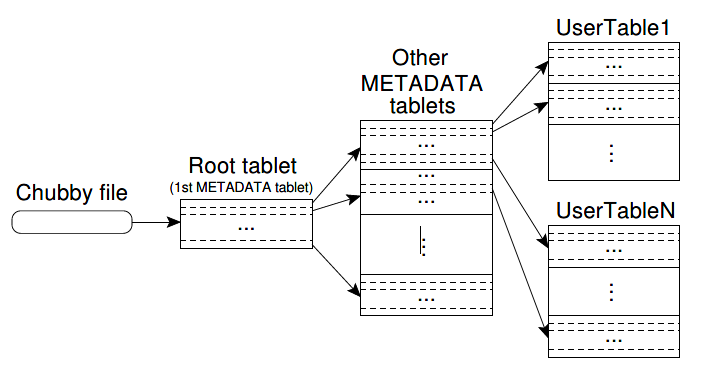
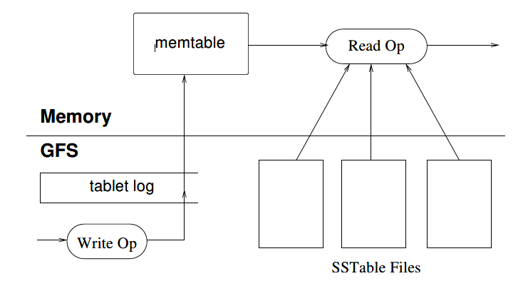

# Bigtable: A Distributed Storage System For Structured Data

## 摘要

Bigtable是用于管理结构化数据的分布式存储系统，该系统旨在扩展到非常大的规模：数千个商用服务器中的PB级数据。 Google的许多项目都将数据存储在Bigtable中，包括网络索引，Google Earth和Google Finance。 这些应用程序在数据大小（从URL到网页到卫星图像）和延迟要求（从后端批量处理到实时数据服务）方面都对Bigtable提出了截然不同的要求。 尽管有各种各样的要求，Bigtable还是为所有这些Google产品成功提供了一种灵活的高性能解决方案。 在本文中，我们描述了Bigtable提供的简单数据模型，该模型为客户提供了对数据布局和格式的动态控制，并描述了Bigtable的设计和实现。

## 1. 介绍

在过去的两年半，我们在Google设计、实现并部署了称为Bigtable的分布式存储系统，用于管理结构化数据。Bigtable旨在可靠地扩展到PB级数据和数千台计算机。 Bigtable实现了多个目标：广泛的适用性，可伸缩性，高性能和高可用性。 Bigtable被60多个Google产品和项目所使用，包括Google Analytics（分析），Google Finance，Orkut，个性化搜索，Writely和Google Earth。 这些产品将Bigtable用于各种要求苛刻的工作负载，从面向吞吐量的批处理作业到对延迟敏感的数据最终用户提供。 这些产品使用的Bigtable集群涵盖从几个服务器到数千个服务器的广泛配置，并存储多达数百TB的数据。

在许多方面，Bigtable类似于数据库：它借鉴了许多数据库实现策略。 并行数据库和主内存数据库已经实现了可伸缩性和高性能，但是Bigtable提供了与此类系统不同的接口。 Bigtable不支持完整的关系数据模型； 相反，它为客户端提供了一个简单的数据模型，该模型支持对数据布局和格式的动态控制，并允许客户端推理基础存储中表示的数据的局部性。 使用可以是任意字符串的行和列名称为数据建立索引。 尽管客户经常将各种形式的结构化和半结构化数据序列化为这些字符串，但Bigtable还将数据视为未解释的字符串。 客户可以通过在方案中进行仔细选择来控制其数据的局部性。 最后，Bigtable模式参数可让客户端动态控制是从内存还是从磁盘提供数据。

第2节将更详细地描述数据模型，第3节将概述客户端API。 第4节简要介绍了Bigtable所依赖的基础Google基础架构。 第5节介绍了Bigtable实现的基础知识，第6节介绍了我们为提高Bigtable的性能所做的一些改进。 第7节提供了Bigtable性能的度量。 在第8节中，我们描述了如何在Google中使用Bigtable的几个示例，并在第9节中，讨论了我们在设计和支持Bigtable方面学到的一些教训。最后，第10节描述了相关工作，第11节介绍了我们的结论。

## 2. 数据模型

Bigtable是一个稀疏的，分布式的，持久的多维排序的map。 该地图由行键，列键和时间戳索引； map中的每个值都是未解释的字节数组。

`(row:string, column:string, time:int64) -> string`


在研究了类似Bigtable的系统的各种潜在用途之后，我们选择了此数据模型。 作为推动我们某些设计决策的一个具体示例，假设我们想要保留大量网页和相关信息的副本，这些副本可以由许多不同的项目使用。 让我们将此特定表称为Webtable。 在Webtable中，我们将使用URL作为行键，将网页的各个方面用作列名，并将网页的内容存储在content：获取记录的时间戳的列，如上图所示。

### 2.1. 行

表中的行键是任意字符串（当前大小最大为64KB，尽管对于大多数用户而言，典型大小是10-100字节）。 单个行键下的每次数据读取或写入都是原子性的（无论该行中读取或写入的不同列的数量如何），该设计决策使客户端在存在同一行的并发更新时更容易推断系统行为。

Bigtable按行键以字典顺序维护数据。 表的行范围是动态分区的。 每个行范围称为一个Tablet，它是分配和负载平衡的单位。 结果，短行范围的读取是有效的，并且通常仅需要与少量机器通信。 客户端可以通过选择行键来利用此属性，以便他们可以很好地进行数据访问。 例如，在Webtable中，通过反转URL的Master名部分，可以将同一域中的页面分组为连续的行。 例如，我们将数据*maps.google.com/index.html*存储在键*com.google.maps/index.html*下。 来自同一域的页面彼此靠近存储，使某些Master和域分析更加有效。

### 2.2. 列族（Column Families）

列键分为称为列族的集合，这些集合构成访问控制的基本单元。 列族中存储的所有数据通常都是同一类型（我们将同一列族中的数据压缩在一起）。 必须先创建一个列族，然后才能将数据存储在该族中的任何列键下。 创建族后，可以使用族中的任何列键。 我们的目的是使表中不同的列族的数量少（最多数百个），并且在操作过程中族很少改变。 相反，表可能具有无限制的列数。

列键使用以下语法命名：`family:qualier`。 列族名称必须是可打印的，但限定符可以是任意字符串。 Webtable的一个示例列族是language，它存储编写网页所用的语言。 我们在语言族中仅使用一个列键，并且它存储每个网页的语言ID。 该表的另一个有用的列族是anchor。 该族中的每个列键代表一个锚，如上图所示。qualier是引用站点的名称； 单元格内容是链接文本。

访问控制以及磁盘和内存计数均在列族级别执行。 在我们的Webtable示例中，这些控件使我们能够管理几种不同类型的应用程序：一些添加新的基本数据，一些读取基本数据并创建派生的列族，某些仅允许查看现有数据（可能不查看）。 甚至出于隐私原因查看所有现有家庭）。

### 2.3. 时间戳

Bigtable中的每个单元格可以包含同一数据的多个版本； 这些版本通过时间戳编制索引。 Bigtable时间戳记是64位整数。 它们可以由Bigtable分配，在这种情况下，它们以微秒为单位表示“实时”，也可以由客户端应用程序明确分配。 需要避免冲突的应用程序必须自己生成唯一的时间戳。 单元格的不同版本以递减的时间戳顺序存储，因此可以首先读取最新版本。

为了减少版本化数据的管理工作，我们支持两个列粒度系列的设置，这些设置告诉Bigtable自动垃圾收集单元格版本。 客户端可以指定仅保留单元格的最后n个版本，或者仅保留新的足够的版本（例如，仅保留最近7天写入的值）。

在我们的Webtable示例中，我们将content：列中存储的已爬网页的时间戳设置为实际爬取这些页面版本的时间。 上述的垃圾收集机制使我们仅保留每个页面的最新三个版本。

## 3. API

Bigtable API提供了用于创建和删除表和列系列的功能。 它还提供了用于更改集群，表和列系列元数据的功能，例如访问控制权限。

客户端应用程序可以在Bigtable中写入或删除值，可以从各个行中查找值，也可以遍历表中的数据子集。 下面显示了使用RowMutation抽象来执行一系列更新的C++代码。 （省略了详细信息，以使示例简短。）对Apply的调用对Webtable进行了原子突变：它将一个锚点添加到www.cnn.com并删除另一个锚点。

```c++
// Open the table
Table *T = OpenOrDie("/bigtable/web/webtable");
// Write a new anchor and delete an old anchor
RowMutation r1(T, "com.cnn.www");
r1.Set("anchor:www.c-span.org", "CNN");
r1.Delete("anchor:www.abc.com");
Operation op;
Apply(&op, &r1);
```

下面显示了使用Scanner抽象对特定行中的所有锚点进行迭代的C++代码。 客户端可以迭代多个列族，并且有几种机制可以限制扫描产生的行，列和时间戳。 例如，我们可以将上面的扫描限制为仅生成其列与正则表达式anchor：*。cnn.com匹配的锚，或者仅生成其时间戳记在当前时间的十天内之内的锚。

```c++
Scanner scanner(T);
ScanStream *stream;
stream = scanner.FetchColumnFamily("anchor");
stream->SetReturnAllVersions();
scanner.Lookup("com.cnn.www");
for (; !stream->Done(); stream->Next()) {
    printf("%s %s %lld %s\n",
        scanner.RowName(),
        stream->ColumnName(),
        stream->MicroTimestamp(),
        stream->Value());
}
```

Bigtable支持其他几种功能，这些功能允许用户以更复杂的方式操作数据。 首先，Bigtable支持单行事务，该事务可用于对存储在单个行键下的数据执行原子的读取-修改-写入序列。 Bigtable目前不支持跨行键的常规事务，尽管它提供了用于在客户端跨行键批处理写入的接口。 其次，Bigtable允许将单元用作整数计数器。 最后，Bigtable支持在服务器的地址空间中执行客户端提供的脚本。 这些脚本是用Google开发的一种用于处理数据的语言（称为Sawzall）编写的。 目前，我们基于Sawzall的API不允许客户端脚本将其写回到Bigtable，但允许多种形式的数据转换，基于任意表达式的筛选以及通过各种运算符的汇总。

Bigtable可与MapReduce结合使用，MapReduce是一种由Google开发的用于运行大规模并行计算的框架。 我们编写了一组包装器，这些包装器允许Bigtable用作MapReduce作业的输入源和输出目标。

## 4. 构建模块

Bigtable建立在Google其他几个基础架构之上。 Bigtable使用GFS存储日志和数据文件。 Bigtable集群通常在运行多种其他分布式应用程序的共享计算机池中运行，并且Bigtable进程通常与其他应用程序的进程共享同一台计算机。 Bigtable依靠集群管理系统来调度作业，管理共享计算机上的资源，处理计算机故障以及监视计算机状态。

Google SSTable文件格式在内部用于存储Bigtable数据。 SSTable提供了从键到值的持久，有序的不可变映射，其中键和值都是任意字节字符串。 提供操作以查找与指定键相关联的值，并遍历指定键范围内的所有键/值对。 在内部，每个SSTable包含一系列块（通常每个块的大小为64KB，但这是可配置的）。 块索引（存储在SSTable的末尾）用于定位块。 当打开SSTable时，索引将加载到内存中。 可以使用单个磁盘搜索来执行查找：我们首先通过在内存索引中执行二分搜索来找到适当的块，然后从磁盘读取适当的块。 可选地，SSTable可以完全映射到内存中，这使我们无需触摸磁盘即可执行查找和扫描。

Bigtable依赖于称为Chubby的高可用性且持久的分布式锁服务。Chubby服务由五个活动副本组成，其中一个活动副本被选为主副本，并主动服务于请求。当大多数副本正在运行时，该服务处于活动状态，并且可以彼此通信。 Chubby使用Paxos算法来面对失败时保持其副本的一致性。 Chubby提供了一个由目录和小文件组成的名称空间。每个目录或文件都可以用作锁，并且对文件的读写是原子的。 Chubby客户端库提供一致的Chubby文件缓存。每个Chubby客户端都维护一个Chubby服务会话。如果客户端的会话无法在租约到期时间内更新其会话租约，则该会话将过期。当客户端的会话到期时，它将丢失所有锁并打开句柄。Chubby客户端还可以在胖文件和目录中注册回调，以通知更改或会话到期的通知。

Bigtable使用Chubby来完成各种任务：确保任何时候最多有一个活动的master； 存储Bigtable数据的引导位置； 发现Tablet电脑服务器并确定Tablet电脑服务器的故障； 存储Bigtable模式信息（每个表的列族信息）； 并存储访问控制列表。 如果Chubby长时间不可用，则Bigtable将不可用。 我们最近在跨越11个Chubby实例的14个Bigtable集群中测量了这种影响。 由于Chubby不可用（由于Chubby中断或网络问题所致），Bigtable服务器小时内无法存储在Bigtable中的某些数据的平均百分比为0.0047％。 受Chubby不可用性影响最大的单个群集的百分比为0.0326％。

## 5. 实现

Bigtable的实现具有三个主要组件：一个链接到每个客户端，一个主服务器和许多Tablet电脑服务器的库。 可以从集群中动态添加（或删除）Tablet服务器，以适应工作负载的变化。

Master负责将Tablet分配给Tablet服务器，检测Tablet服务器的添加和到期，平衡Tablet服务器的负载以及GFS中文件的垃圾回收。 此外，它还处理模式更改，例如创建表和列族。

每个Tablet服务器管理一组Tablet（通常每个Tablet服务器有十到一千个Tablet）。 Tablet服务器处理对已加载的Tablet的读写请求，并且还会拆分太大的Tablet。

与许多单主分布式存储系统一样，客户端数据不会在master中移动：客户端直接与Tablet服务器通信以进行读取和写入。 由于Bigtable客户端不依赖master获取Tablet的位置信息，因此大多数客户端从不与master通信。 结果，在实践中master被轻载。

Bigtable集群存储许多表。 每个表由一组Tablet组成，并且每个Tablet包含与行范围相关联的所有数据。 最初，每个表格仅包含一个Tablet。 随着表的增长，它会自动拆分为多个Tablet，默认情况下每个Tablet的大小约为100-200 MB。

### 5.1. Tablet位置

我们使用类似于B+树的三级层次结构来存储Tablet位置信息。



第一级是存储在Chubby中的文件，其中包含root tablet的位置。 root tablet在特殊的METADATA表中包含所有tablet的位置。 每个METADATATablet都包含一组user tablet的位置。 root tablet只是METADATA表中的第一个tablet，但经过特殊处理（从不分割），以确保tablet位置层次结构不超过三个级别。

METADATA表存储Tablet在行键下的位置，该行键是Tablet表标识符及其末尾行的编码。 每个METADATA行在内存中存储大约1KB的数据。 由于有限的128 MB METADATA Tablet限制，我们的三级定位方案足以处理234个Tablet（或128 MBTablet中的261字节）。

客户端库缓存Tablet的位置。 如果客户端不知道Tablet的位置，或者发现缓存的位置信息不正确，则它将在Tablet位置层次结构中递归移动。 如果客户端的缓存为空，则定位算法需要进行三次网络往返，包括从Chubby中读取一次。 如果客户端的缓存是陈旧的，则定位算法最多可能需要进行六次往返，因为陈旧的缓存条目仅在未命中时发现（假设METADATA Tablet的移动频率不高）。 尽管Tablet的位置存储在内存中，所以不需要GFS访问，但在常见情况下，我们通过让客户端库预取Tablet的位置进一步降低了此成本：每当读取METADATA表时，它都会读取一个以上Tablet的元数据。

我们还将辅助信息存储在METADATA表中，包括与每个Tablet有关的所有事件的日志（例如服务器何时开始为其服务）。 此信息有助于调试和性能分析。

### 5.2. Tablet分配

每个Tablet一次分配到一个Tablet服务器。 Master跟踪活动Tablet服务器的集合以及Tablet到Tablet服务器的当前分配，包括未分配的Tablet。 当未分配Tablet并且有足够的空间供Tablet使用的Tablet服务器可用时，Master通过向Tablet服务器发送Tablet加载请求来分配Tablet。

Bigtable使用Chubby来跟踪Tablet服务器。Tablet服务器启动时，它将在特定的Chubby目录中创建并获得唯一锁定的唯一名称的文件。Master监视此目录（服务器目录）以发现Tablet服务器。Tablet服务器如果丢失独占锁定，则会停止为其Tablet提供服务：例如，由于网络分区导致服务器丢失了Chubby会话。 （Chubby提供了一种有效的机制，允许Tablet服务器检查它是否仍然保持其锁定而不会引起网络流量。）只要文件仍然存在，Tablet服务器就会尝试重新获取其文件的排他锁。如果该文件不再存在，则Tablet服务器将永远无法再次提供服务，因此它将自行终止。Tablet服务器终止时（例如，由于群集管理系统正在从群集中删除Tablet服务器的计算机），它将尝试释放其锁定，以便master可以更快地重新分配其Tablet。

Master负责检测何时不再为Tablet提供服务，并负责尽快重新分配这些Tablet。为了检测Tablet服务器何时不再为其Tablet提供服务，master会定期向每个Tablet服务器询问其锁定状态。如果Tablet服务器报告已丢失其锁，或者如果master在最后几次尝试期间都无法访问服务器，则master将尝试获取服务器文件的排他锁。如果master能够获取锁，则Chubby处于活动状态，并且Tablet服务器已死或无法访问Chubby，因此master可以通过删除其服务器文件确保Tablet服务器再也无法服务。删除服务器的文件后，master可以将先前分配给该服务器的所有Tablet移至未分配的Tablet集中。为了确保Bigtable群集不会受到master和Chubby之间的网络问题的影响，如果master的Chubby会话到期，则master会自行杀死。但是，如上所述，master故障不会更改Tablet到Tablet服务器的分配。

当master由集群管理系统启动时，它需要先发现当前的Tablet分配，然后才能更改它们。 Master在启动时执行以下步骤。 （1）Master在Chubby中获取唯一的master锁，这可以防止并发的master实例化。 （2）Master扫描Chubby中的服务器目录以找到活动服务器。 （3）Master与每个活动Tablet服务器通信，以发现已分配给每个服务器的Tablet。 （4）Master扫描METADATA表以获取Tablet集。 每当此扫描遇到尚未分配的Tablet时，master就会将该Tablet添加到未分配的Tablet集中，这使该Tablet有资格进行Tablet分配。

一种复杂的情况是，在分配METADATATablet之前，无法进行METADATA表的扫描。 因此，在开始此扫描（步骤4）之前，如果在步骤3中未找到针对Root Tablet的分配，则master会将Root Tablet添加到未分配Tablet的集合中。此添加操作确保了将对Root Tablet进行分配。 由于Root Tablet包含所有METADATA Tablet的名称，因此master在扫描了rootTablet之后便知道了所有这些名称。

现有Tablet的集合仅在创建或删除表，将两个现有Tablet合并以形成一个较大的Tablet或将现有Tablet分为两个较小的Tablet时更改。 Master能够跟踪这些更改，因为它会启动除最后那个以外的所有操作。 Tablet拆分是由Tablet服务器启动的，因此受到特殊对待。 Tablet服务器通过在METADATA表中记录新Tablet的信息来提交拆分。 提交拆分后，它将通知master。 万一拆分通知丢失（由于Tablet服务器或Master死亡），则master在要求Tablet服务器加载已拆分的Tablet时会检测到新的Tablet。 Tablet服务器将把拆分通知Master，因为它在METADATA表中找到的Tablet条目将只指定Master要求加载的Tablet的一部分。

### 5.3. Tablet 服务

Tablet的持久状态存储在GFS中，如图所示。更新被提交到存储重做(redo)记录的提交日志。 在这些更新中，最近提交的更新存储在内存中的排序buffer（称为内存表）中。 较旧的更新存储在一系列SSTable中。 为了恢复Tablet，Tablet服务器从METADATA表读取其元数据。 此元数据包含包含Tablet和一组重做点(redo point)的SSTables列表，这些重做点是指向可能包含Tablet数据的任何提交日志的指针。 服务器将SSTables的索引读入内存，并通过应用自重做点以来提交的所有更新来重建内存表。



当写操作到达Tablet服务器时，服务器将检查其格式是否正确，以及发送方是否有权执行该修改。 通过从Chubby文件中读取允许的写者列表来执行授权（这在Chubby客户端缓存中几乎总是命中）。 有效的修改将写入提交日志。 组提交(Group commit)用于提高许多小修改的吞吐量。 提交写入后，其内容将插入到内存表中。

当读取操作到达Tablet服务器时，同样会检查其格式是否正确以及是否获得适当的授权。 在SSTables和memtable序列的合并视图上执行有效的读取操作。 由于SSTables和memtable是按字典顺序排序的数据结构，因此可以有效地形成合并视图。

拆分和合并Tablet时，传入的读写操作可以继续。

### 5.4. 压缩

随着写操作的执行，内存表的大小增加。 当内存表大小达到阈值时，该内存表被冻结，创建新的内存表，并将冻结的内存表转换为SSTable并写入GFS。 这个次要的压缩过程有两个目标：减少Tablet服务器的内存使用量，并且减少如果该服务器死机在恢复期间必须从提交日志中读取的数据量。 发生压缩时，传入的读取和写入操作可以继续。

每次较小的压缩都会创建一个新的SSTable。 如果此行为未经检查继续，则读操作可能需要合并任意数量的SSTables中的更新。 相反，我们通过在后台定期执行合并压缩来限制此类文件的数量。 合并压缩读取一些SSTables和memtable的内容，并写出新的SSTable。 压缩完成后，可以立即丢弃输入SSTables和memtable。

将所有SSTable重写为一个SSTable的合并压缩称为主要压缩(Major Compaction)。 由非主要压缩产生的SSTable可以包含特殊的删除条目，这些条目删除仍然存在的较旧SSTable中的已删除数据。 另一方面，重大压缩主要压缩会产生一个SSTable，该表不包含删除信息或已删除的数据。 Bigtable会遍历其所有Tablet，并定期对其应用主要压缩。 这些主要压缩使Bigtable可以回收已删除数据所使用的资源，还可以确保Bigtable及时地从系统中删除已删除的数据，这对于存储敏感数据的服务很重要。
