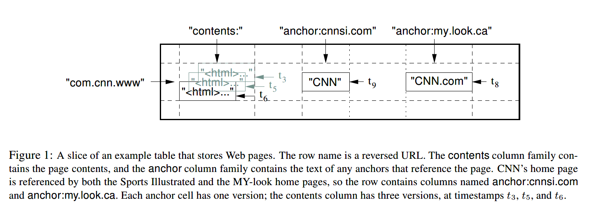

# Bigtable: A Distributed Storage System For Structured Data

## 摘要

Bigtable是用于管理结构化数据的分布式存储系统，该系统旨在扩展到非常大的规模：数千个商用服务器中的PB级数据。 Google的许多项目都将数据存储在Bigtable中，包括网络索引，Google Earth和Google Finance。 这些应用程序在数据大小（从URL到网页到卫星图像）和延迟要求（从后端批量处理到实时数据服务）方面都对Bigtable提出了截然不同的要求。 尽管有各种各样的要求，Bigtable还是为所有这些Google产品成功提供了一种灵活的高性能解决方案。 在本文中，我们描述了Bigtable提供的简单数据模型，该模型为客户提供了对数据布局和格式的动态控制，并描述了Bigtable的设计和实现。

## 1. 介绍

在过去的两年半，我们在Google设计、实现并部署了称为Bigtable的分布式存储系统，用于管理结构化数据。Bigtable旨在可靠地扩展到PB级数据和数千台计算机。 Bigtable实现了多个目标：广泛的适用性，可伸缩性，高性能和高可用性。 Bigtable被60多个Google产品和项目所使用，包括Google Analytics（分析），Google Finance，Orkut，个性化搜索，Writely和Google Earth。 这些产品将Bigtable用于各种要求苛刻的工作负载，从面向吞吐量的批处理作业到对延迟敏感的数据最终用户提供。 这些产品使用的Bigtable集群涵盖从几个服务器到数千个服务器的广泛配置，并存储多达数百TB的数据。

在许多方面，Bigtable类似于数据库：它借鉴了许多数据库实现策略。 并行数据库和主内存数据库已经实现了可伸缩性和高性能，但是Bigtable提供了与此类系统不同的接口。 Bigtable不支持完整的关系数据模型； 相反，它为客户端提供了一个简单的数据模型，该模型支持对数据布局和格式的动态控制，并允许客户端推理基础存储中表示的数据的局部性。 使用可以是任意字符串的行和列名称为数据建立索引。 尽管客户经常将各种形式的结构化和半结构化数据序列化为这些字符串，但Bigtable还将数据视为未解释的字符串。 客户可以通过在方案中进行仔细选择来控制其数据的局部性。 最后，Bigtable模式参数可让客户端动态控制是从内存还是从磁盘提供数据。

第2节将更详细地描述数据模型，第3节将概述客户端API。 第4节简要介绍了Bigtable所依赖的基础Google基础架构。 第5节介绍了Bigtable实现的基础知识，第6节介绍了我们为提高Bigtable的性能所做的一些改进。 第7节提供了Bigtable性能的度量。 在第8节中，我们描述了如何在Google中使用Bigtable的几个示例，并在第9节中，讨论了我们在设计和支持Bigtable方面学到的一些教训。最后，第10节描述了相关工作，第11节介绍了我们的结论。

## 2. 数据模型

Bigtable是一个稀疏的，分布式的，持久的多维排序的map。 该地图由行键，列键和时间戳索引； map中的每个值都是未解释的字节数组。

`(row:string, column:string, time:int64) -> string`

在研究了类似Bigtable的系统的各种潜在用途之后，我们选择了此数据模型。 作为推动我们某些设计决策的一个具体示例，假设我们想要保留大量网页和相关信息的副本，这些副本可以由许多不同的项目使用。 让我们将此特定表称为Webtable。 在Webtable中，我们将使用URL作为行键，将网页的各个方面用作列名，并将网页的内容存储在content：获取记录的时间戳的列，如上图所示。

### 2.1. 行

表中的行键是任意字符串（当前大小最大为64KB，尽管对于大多数用户而言，典型大小是10-100字节）。 单个行键下的每次数据读取或写入都是原子性的（无论该行中读取或写入的不同列的数量如何），该设计决策使客户端在存在同一行的并发更新时更容易推断系统行为。

Bigtable按行键以字典顺序维护数据。 表的行范围是动态分区的。 每个行范围称为一个数位板，它是分配和负载平衡的单位。 结果，短行范围的读取是有效的，并且通常仅需要与少量机器通信。 客户端可以通过选择行键来利用此属性，以便他们可以很好地进行数据访问。 例如，在Webtable中，通过反转URL的主机名部分，可以将同一域中的页面分组为连续的行。 例如，我们将数据*maps.google.com/index.html*存储在键*com.google.maps/index.html*下。 来自同一域的页面彼此靠近存储，使某些主机和域分析更加有效。

### 2.2. 列族（Column Families）

列键分为称为列族的集合，这些集合构成访问控制的基本单元。 列族中存储的所有数据通常都是同一类型（我们将同一列族中的数据压缩在一起）。 必须先创建一个列族，然后才能将数据存储在该族中的任何列键下。 创建族后，可以使用族中的任何列键。 我们的目的是使表中不同的列族的数量少（最多数百个），并且在操作过程中族很少改变。 相反，表可能具有无限制的列数。

列键使用以下语法命名：`family:qualier`。 列族名称必须是可打印的，但限定符可以是任意字符串。 Webtable的一个示例列族是language，它存储编写网页所用的语言。 我们在语言族中仅使用一个列键，并且它存储每个网页的语言ID。 该表的另一个有用的列族是anchor。 该族中的每个列键代表一个锚，如上图所示。qualier是引用站点的名称； 单元格内容是链接文本。

访问控制以及磁盘和内存计数均在列族级别执行。 在我们的Webtable示例中，这些控件使我们能够管理几种不同类型的应用程序：一些添加新的基本数据，一些读取基本数据并创建派生的列族，某些仅允许查看现有数据（可能不查看）。 甚至出于隐私原因查看所有现有家庭）。

### 2.3. 时间戳

Bigtable中的每个单元格可以包含同一数据的多个版本； 这些版本通过时间戳编制索引。 Bigtable时间戳记是64位整数。 它们可以由Bigtable分配，在这种情况下，它们以微秒为单位表示“实时”，也可以由客户端应用程序明确分配。 需要避免冲突的应用程序必须自己生成唯一的时间戳。 单元格的不同版本以递减的时间戳顺序存储，因此可以首先读取最新版本。

为了减少版本化数据的管理工作，我们支持两个列粒度系列的设置，这些设置告诉Bigtable自动垃圾收集单元格版本。 客户端可以指定仅保留单元格的最后n个版本，或者仅保留新的足够的版本（例如，仅保留最近7天写入的值）。

在我们的Webtable示例中，我们将content：列中存储的已爬网页的时间戳设置为实际爬取这些页面版本的时间。 上述的垃圾收集机制使我们仅保留每个页面的最新三个版本。
