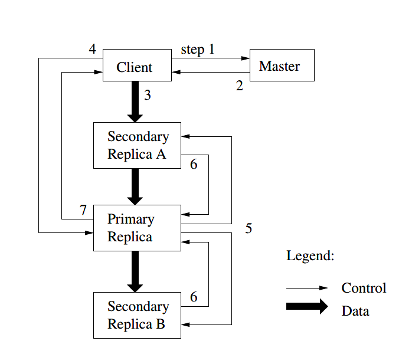

# The Google File System

**关键字**：容错，扩展性，数据存储，集群存储

## 1. 介绍

我们已经设计并实现了Google File System(GFS)来应对Google在数据处理方面快速增长的需求。GFS有着和以前的分布式文件系统共同的目标，比如性能，扩展性，可靠性和可用性。然而，其设计一直由对我们当前和预期的应用程序负载和技术氛围的观察所驱动，这也反映出与一些早期文件系统设计理念有差异。

**第一，组件的失败并非是异常，而是正常的**。这个文件系统由成百上千个廉价的商品部件拼装的存储机器组成，并且被相当数量的客户端机器访问。组件的数量和质量实际上保证了某些组件在任何给定的时间都无法运行，并且某些组件将无法从当前的失败中恢复过来。我们已经见过由下列因素造成的问题：程序bug，操作系统bug，人类犯错，以及磁盘，内存，连接器，网络，电源的失败。所以，不间断的监控，错误侦测，错误容忍，以及自动恢复这些功能必定要集成到系统中。

**第二，按照传统标准文件是巨大的**。几GB的文件很常见。每个文件通常包含很多应用程序对象，比如web文档。当我们定期处理包含数十亿对象的许多TBs的快速增长的数据集，即使文件系统支持数十亿约KB大小的文件，也难以管理。总之，必须重新考虑设计理念以及一些参数，比如I/O操作和块大小。

**第三，大部分文件的修改是追加新数据而不是覆写原数据**。实际中，文件的随机写是不存在的。文件被写入后只用来读，而且经常是顺序读。各种数据都拥有这些特征。一些可能会组成大型存储库，被数据分析程序扫描。一些可能是应用程序持续生成的数据流。一些可能是归档数据。一些可能是一台机器上产生的中间结果，而在另一台机器上同时或稍后产生。鉴于对大型文件的这种访问方式，追加写成为性能优化和原子性保证的重点，然而把数据块存储在客户端则失去了吸引力。

**第四，共同设计应用程序和文件系统API增加灵活性使得整个系统受益**。例如，我们放宽了GFS的一致性模型，以极大地简化文件系统，并且不会给应用程序带来繁重的负担。我们也介绍了一个原子性的并发操作以至于多个客户端可以同时对一个文件追加而不需要额外的同步。

## 2. 设计概述

### 2.1. 假设

* 该系统由许多经常发生故障的廉价商品组件组成。它必须不间断地自我监控和检测，并从组件故障中迅速恢复。

* 系统存储少量的大文件。我们预计有几百万个文件，每个通常100MB或者更大。几GB的文件很常见，需要有效地管理。小文件必须支持，但是我们不必对其优化。

* 工作负载主要源于两种读：大量流读取和小量随机读。对于大量流读取，每次通常读取几百KBs，1MB或更多。同一个客户端的后续操作经常读取文件的连续区域。一个小量随机读通常在随机位置读取几KBs。注重性能的应用程序经常对小读取进行批处理和排序，以稳定地通过文件而不是来回移动。

* 高持续带宽比低延迟更重要，我们的大多数目标应用程序都很重视高速处理大量数据，而很少会对单次读写的响应时间有严格要求。

### 2.2. 接口

GFS提供熟悉的文件系统接口，尽管它没有实现一个标准API比如POSIX。文件在目录中按层次结构组织，并由路径名标识。 我们支持创建，删除，打开，关闭，读取和写入文件的常规操作。

除此之外，GSF有快照和记录追加操作。快照低成本地创建文件或目录树的副本。记录追加允许多个客户端同时将数据追加到同一个文件中，同时保证每个客户端的追加的原子性。这对于实现多路合并结果和生产者消费者队列很有用，许多客户端可以在不加锁的情况下追加。

### 2.3. 架构

一个GFS集群由一个master和多个chunkservers组成，并且被多个客户端访问。如下图，这些设备通常都是运行用户级服务器进程的商用Linux机器。同一个机器上很容易运行一个chunkserver和一个客户端，只要机器资源允许，并且可以接受运行不稳定的应用程序引起较低的可靠性。

文件被划分到固定大小的chunk。每个chunk被创建时，master会分配一个不可变、全局唯一的64位chunk handle，并以此标识。Chunkservers以Linux文件的形式存储chunks在本地磁盘，并读写由chunk handle和字节范围指定的chunk数据。对于可靠性，每个chunk在多个chunkservers上被复制。默认情况下，我们存储三个副本，尽管用户可以为文件名称空间的不同区域指定不同的复制级别。

Master维护所有的文件系统元数据，包括命名空间，访问控制信息，文件到chunk的映射，和chunks的当前位置。它还控制整个系统的活动，例如chunk的租赁管理，孤立块的垃圾回收以及chunk在chunkservers的迁移。Master周期性地以心跳消息与每个chunkservers通信，下达指令和收集状态。

GFS客户端实现了文件系统API，并与master和chunkservers通信以代表应用程序读写数据。客户端与服务器交互来进行元数据操作，但是所有承载数据的通信都直接发送给chunkservers。

客户端和chunkservers都不缓存文件数据。客户端缓存几乎没有什么好处，因为大多数应用程序会处理巨大的文件，或者工作集太大而无法缓存。 没有它们，就消除了缓存一致性问题，从而简化了客户端和整个系统。 （但是，客户端确实缓存元数据。）块服务器不需要缓存文件数据，因为大块存储为本地文件，因此Linux的缓冲区缓存已经将经常访问的数据保存在内存中。

### 2.4. Single Master

拥有一个master极大地简化了我们的设计，并使master可以使用全局信息来制定复杂的chunk放置和复制决策。然而， 我们必须最小化它在读写中的参与，以免它成为瓶颈。客户端永远不会通过master读写文件数据。取而代之的是，客户端询问主服务器应该联系哪些块服务器。 它在有限的时间内缓存此信息，并直接与块服务器交互以进行许多后续操作。

我们参考上图简单解释一下读操作的交互，首先，使用固定的chunk大小，客户端将应用程序指定的文件名和字节偏移量转换为文件内的chunk索引。 然后，它向master发送一个包含文件名和chunk索引的请求。 master响应相应的chunk handle和副本的位置。 客户端使用文件名和chunk索引作为关键字来缓存此信息。

然后，客户端将请求发送到其中一个副本，很可能是最接近的副本。 该请求指定了chunk handle和该chunk内的字节范围。 在缓存信息过期或重新打开文件之前，对同一chunk的进一步读取不再需要客户端与master之间的交互。 实际上，客户端通常会在同一请求中请求多个chunk，而master也可以在请求的chunk之后立即包含chunk的信息。 这些额外的信息绕开了未来几个客户-master交互的机会，而实际上没有任何额外的开销。

### 2.5. Chunk Size

Chunk size是一个关键的设计参数。我们选择了64MB，比通常的文件系统block size大得多。每个chunk副本作为纯Linux文本存储在chunkserver，并且在需要时进行扩展。Lazy空间分配避免了由于内部碎片而浪费空间。

大chunk size具有几个重要的优点。第一，它减少了客户端与master的交互需求，因为对同一个chunk的读写只需要向master发生一个初始请求即可获取chunk位置信息。这对于我们的工作量尤其重要，因为应用程序通常顺序读写大文件。即使是小的随机读，客户端也可以轻松地缓存多个TB工作集的所有chunk位置信息。其次，由于在较大的块上，客户端更有可能在给定的块上执行许多操作，因此它可以通过在延长的时间段内保持与块服务器的持久TCP连接来减少网络开销。第三，它减小了存储在主服务器上的元数据的大小。 这使我们能够将元数据保留在内存中，从而带来其他优势，

另一方面，大chunk size（即使具有惰性空间分配）也有其缺点。 一个小文件由少量chunk组成，也许只有一个。 如果许多客户端正在访问同一文件，则存储这些chunks的chunkservers可能会成为热点。 实际上，热点并不是主要问题，因为我们的应用程序通常会顺序读取大型的多chunks文件。

但是，当批处理队列系统首次使用GFS时，热点确实出现了：可执行文件作为一个单chunk文件写入GFS，然后同时在数百台计算机上启动。 数以百计的同时请求使存储此可执行文件的少数块服务器超负荷运行。 我们通过存储具有较高复制因子的可执行文件并通过使批处理队列系统错开应用程序的启动时间来解决此问题。 潜在的长期解决方案是在这种情况下允许客户端从其他客户端读取数据。

### 2.6. Metadata

Master存储三种主要类型的元数据：文件和chunk命名空间，从文件到chunk的映射以及每个chunk副本的位置。所有元数据都保存在master的内存中，前两种类型（命名空间和文件到chunk的映射）还通过将修改记录到存储在master本地磁盘上并在远程计算机上复制的操作日志中而保持不变。使用日志可以使我们简单、可靠地更新master状态，而不会在master崩溃时冒不一致的风险。master服务器不会永久存储块位置信息，相反，它会在启动时以及每当一个chunkserver加入集群时就向每个chunkserver询问其chunk。

#### 2.6.1. 内存数据结构

因为元数据存储在内存，所以master的操作很快，master可以在后台容易且有效地周期性地扫描整体的状态。此定期扫描用于实现chunk垃圾回收，在chunkserver发生故障时进行重新复制以及chunk迁移以平衡chunkserver之间的负载和磁盘空间使用情况。

这种仅使用内存的方法的一个潜在问题是chunk的数量以及整个系统的容量受master拥有多少内存的限制。在实践中这不是严重的限制。 Master为每个64 MB chunk维护少于64字节的元数据。 大多数chunk是满的，因为大多数文件包含许多chunk，只有最后一部分可能会被部分填充。 同样，文件名称空间数据每个文件通常需要少于64个字节，因为它使用前缀压缩将文件名压缩存储。

如果需要支持更大的文件系统，则向master添加额外内存的成本也很小，通过将元数据存储在内存中而获得的简单性，可靠性，性能和灵活性。

#### 2.6.2. Chunk 位置

Master不保留有关哪些chunkserver具有给定chunk副本的持久记录。 它只是在启动时轮询chunkserver以获取该信息。 之后，master可以保持最新状态，因为它可以控制所有块的放置并使用常规HeartBeat消息监视块服务器的状态。

我们最初尝试将chunk位置信息永久保留在master上，但是我们决定在启动时向chunkserver请求数据，那样要容易得多，此后再定期进行。 这消除了在chunkserver加入和离开集群，更改名称，失败，重新启动等时，使master和chunkserver保持同步的问题。 在具有数百台服务器的群集中，这种事经常发生。

理解这个设计的另一种方法是认识到，chunkserver对自己的磁盘上有没有chunk有最终决定权。 试图在master上维护此信息的一致性视图没有任何意义，因为chunkserver上的错误可能会导致chunk自发消失（例如，磁盘可能损坏并被禁用），或者操作员可能会重命名chunkserver。

#### 2.6.3. 操作日志

操作日志包含关键元数据更改的历史记录。 它是GFS的核心。 它不仅是元数据的唯一持久记录，而且还用作定义并发操作顺序的逻辑时间表。 文件和chunk及其版本均由创建它们的逻辑时间唯一且永恒地标识。

由于操作日志至关重要，因此我们必须可靠地存储日志，并且在使元数据更改保持不变之前，更改对客户端不可见。 否则，即使这些chunk本身仍然存在，我们也会有效地丢失整个文件系统或最近的客户端操作。 因此，我们将其复制到多台远程计算机上，并且仅在将相应的日志记录刷新到本地和远程磁盘后才响应客户端操作。 主服务器在刷新之前将几个日志记录一起批处理，从而减少了刷新和复制对整个系统吞吐量的影响。

主服务器通过重放操作日志来恢复其文件系统状态。 为了最大程度地减少启动时间，我们必须保持日志较小。 每当日志增长到超过特定大小时，master就会检查其状态，以便可以通过从本地磁盘加载最新的检查点并在此之后仅重放有限数量的日志记录来进行恢复。 该检查点采用类似于B树的紧凑形式，可以直接映射到内存中并用于命名空间查找，而无需额外的解析。 这进一步加快了恢复速度并提高了可用性。

由于建立检查点可能要花一些时间，因此master的内部状态的构造方式可以在不延迟传入改变的情况下创建新的检查点。 Master切换到新的日志文件，并在单独的线程中创建新的检查点。 新的检查点包括切换之前的所有改变。 对于具有数百万个文件的群集，可以在一分钟左右的时间内创建它。 完成后，将其本地和远程写入磁盘。

恢复仅需要最新的完整检查点和后续日志文件。 可以自由删除较旧的检查点和日志文件，尽管我们保留了一些检查点以防灾难。 检查点期间的故障不会影响正确性，因为恢复代码会检测并跳过不完整的检查点。

### 2.7. 一致性模型

GFS拥有一个宽松的一致性模型，该模型可以很好地支持我们高度分散的应用程序，但是实现起来相对简单有效。 现在，我们讨论GFS的担保及其对应用程序的意义。 我们还将重点介绍GFS如何维持这些保证，但将细节留给本文的其他部分。

#### 2.7.1. GFS's 担保

文件命名空间修改（例如文件创建）是原子的。 它们仅由master处理：命名空间锁定可确保原子性和正确性； master操作日志定义了这些操作的全局总顺序。

数据修改后文件区域的状态取决于修改的类型，它是成功还是失败以及是否存在并发修改。下表总结了结果。如果所有客户端始终读取相同的数据，则无论它们从哪个副本中读取文件，文件区域都是一致的。如果文件数据修改是一致的，则定义一个区域，客户端将看到该修改的全部内容。当修改成功而不受并发写的干扰时，将定义受影响的区域（并通过隐含一致的方式）：所有客户端将始终看到该修改所写的内容。并发成功的修改使该区域不确定但保持一致：所有客户都看到相同的数据，但可能无法反映任何一个修改所写的内容。通常，它由来自多个修改的混合片段组成。失败的修改会使区域不一致（因此也未定义）：不同的客户端可能会在不同的时间看到不同的数据。我们在下面描述我们的应用程序如何区分已定义区域和未定义区域。应用程序无需进一步区分不同类型的未定义区域。

||Write|Record append|
|-|-|-|
|Serial success|defined|defined interspersed with inconsistent|
|COncurrent successes|consistent but undefined|defined interspersed with inconsistent|
|Failure|inconsistent|inconsistent|

数据突变可以是写入或记录追加。 写入会导致将数据写入应用程序指定的文件偏移中。 记录追加使数据（“记录”）即使在存在并发突变的情况下也至少原子地追加了一次，但要经过GFS的选择。 （相比之下，“常规”追加只是客户机认为其是文件当前结尾的偏移量上的写操作。）此偏移量将返回给客户端，并标记包含记录的已定义区域的开始。 此外，GFS可能会在其间插入填充或记录重复项。 它们占据被认为不一致的区域，通常与用户数据量相形见绌。

经过一系列成功的修改后，可以确保定义了修改的文件区域，并包含最后一次修改写入的数据。 GFS通过在其所有副本上以相同顺序对chunk apply突变来实现此目的，以及使用chunk版本号来检测由于其chunkserver宕机时丢失了修改而变得陈旧的任何副本。 陈旧的副本永远不会参与任何修改，也不会提供给客户端向master询问块位置。 它们会被尽快回收。

由于客户端缓存chunk位置，因此它们可以在刷新该信息之前从陈旧的副本中读取。 这个时间窗口受缓存条目的超时和文件的下一次打开限制，文件从缓存中清除该文件的所有chunk信息。 此外，由于我们的大多数文件都是仅追加文件，所以陈旧的副本通常会返回块的过早结尾，而不是陈旧的数据。 当客户端重试并联系master时，它将立即获得当前块位置。

成功修改后很长时间，组件故障仍会破坏或破坏数据。 GFS通过master与所有chunkserver之间的定期握手来识别故障的chunkserver，并通过校验和检测数据损坏。 一旦出现问题，将尽快从有效副本中恢复数据。 只有在GFS可以做出反应之前（通常在几分钟之内），所有chunk的所有副本都丢失，才会不可逆转地丢失块。 即使在这种情况下，它也变得不可用，而不是损坏：应用程序将收到明显的错误而不是损坏的数据。

#### 2.7.2. Implications for Applications

GFS应用程序可以使用一些简单技术来适应宽松的一致性模型：依靠追加而不是覆写，检查点以及编写自验证，自识别记录。

实际上，我们所有的应用程序都通过追加而不是覆写来使文件发生修改。 一种典型的用法，写者会从头到尾生成一个文件。 写入所有数据后，它会原子地将文件重命名为永久名称，或者定期检查成功写入了多少数据。 检查点还可以包括应用程序级别的校验和。 读者仅验证和处理直到最后一个已定义检查点的文件区域。 无论一致性和并发性问题如何，这种方法都为我们提供了很好的服务。 与随机写入相比，追加的效率要高得多，并且对应用程序故障的恢复能力也更高。 检查点允许写者以增量方式重新启动，并阻止读者处理从应用程序角度来看仍不完整的成功写入文件数据。

在另一种典型用法中，许多写着同时将其追加到文件中以合并结果或作为生产者-消费者队列。记录追加的至少一次追加语义保留了每个写着的输出。读者对偶尔的填充和重复项的处理如下，写者编写的每条记录都包含诸如校验和之类的额外信息，以便可以验证其有效性。读者可以使用校验和识别并丢弃多余的填充并记录片段。如果它不能容忍偶尔的重复（例如，如果它们会触发非幂等的操作），则可以使用记录中的唯一标识符将其过滤掉，而无论如何要为相应的应用程序实体（例如Web文档）命名，通常都需要使用这些标识符。记录I / O的这些功能（去除冗余除外）在库代码中，并且适用于Google的其他文件接口实现。这样一来，相同的记录顺序，加上稀有的重复项，始终会传送到读者。

## 3. 系统交互

我们设计了该系统，以最大程度地减少master参与所有操作的时间。 在此背景下，我们现在描述客户端，master和chunkserver如何交互以实现数据修改，原子记录追加和快照。

### 3.1. 租约和变更顺序

修改是一种更改chunk的内容或元数据的操作，例如写操作或追加操作。 每个修改都在所有chunk的副本中执行。 我们使用租约来维护副本之间一致的突变顺序。 Master将chunk租约授予其中一个副本，我们称之为主副本。 主副本为该chunk的所有修改选择一个序列顺序。 应用修改时，所有副本均遵循此顺序。 因此，全局突变顺序首先由master选择的租赁授权顺序定义，而在租赁范围内则由主副本分配的序列号定义。

租赁机制旨在最大程度地减少master上的管理开销。 租约的初始超时为60秒。 但是，只要对chunk进行了修改，主副本就可以无限期地请求并通常从master接收扩展。 这些扩展请求和授权会承载在master与所有chunkserver之间定期交换的HeartBeat消息上。 Master有时可能会尝试在租约到期之前撤销租约（例如，当master希望对正在重命名的文件禁用修改时）。 即使master与主副本失去通信，它也可以在旧租约到期后安全地将新租约授予另一个副本。

在下图中，我们通过遵循这几步写入控制流程来说明此过程。

1. 客户端向master询问哪个chunkserver持有该chunk的当前租约以及其他副本的位置。 如果没有人租用，则master将其授予其选择的副本（未显示）。
2. Master响应主副本的标识以及其他（辅助）副本的位置。 客户端缓存此数据以备将来使用。 仅当主副本无法访问或响应它不再持有租约时，它才需要再次与master联系。
3. 客户端将数据推送到所有副本。 客户端可以按照任何顺序进行操作。 每个chunkserver将数据存储在内部LRU缓冲区缓存中，直到数据被使用或过期。 通过将数据流与控制流分离，我们可以通过基于网络拓扑调度昂贵的数据流来提高性能，而不管哪个chunkserver是主要的。
4. 一旦所有副本都确认已接收到数据，客户端就会向主副本发送写请求。 该请求标识了较早推送到所有副本的数据。 主副本为可能从多个客户端接收到的所有修改分配连续的序列号，这提供了必要的序列化。 它将修改按序列号顺序应用于自己的本地状态。
5. 主副本将写请求转发到所有从副本。 每个从副本均按主副本分配的相同序列号顺序应用修改。
6. 从副本均答复主副本，表明它们已完成操作。
7. 主副本答复客户端。在任何副本上遇到的任何错误都将报告给客户端。 如果有错误，写操作可能会在主副本和从副本的任意子集成功完成。 （如果它在主副本上失败，则不会分配序列号并转发。）客户端请求被视为失败，并且修改后的区域处于不一致状态。 我们的客户代码通过重试失败的修改来处理此类错误。 在从写入开始返回到重试之前，它将在步骤（3）到（7）进行一些尝试。

