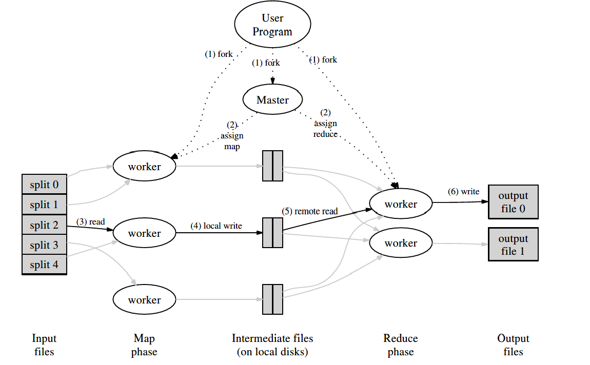

# MapReduce: Simpli ed Data Processing on Large Clusters

## 摘要

MapReduce是用于处理和生成大型数据集的编程模型和相关的实现。 用户指定一个处理键/值对以生成一组中间键/值对的map函数，以及一个归并与同一中间键关联的所有中间值的reduce函数。 如本文所示，在此模型中可以表达许多现实世界中的任务。

以这种功能风格编写的程序会自动并行化，并在大型商用机器集群上执行。 运行时系统负责划分输入数据，安排程序在一组机器上的执行，处理机器故障以及管理所需的机器间通信的细节。 这使没有并行和分布式系统经验的程序员可以轻松利用大型分布式系统的资源。

我们对MapReduce的实现可在大型商用机器集群上运行，并且具有高度可扩展性：典型的MapReduce计算可在数千台机器上处理数TB的数据。 程序员发现该系统易于使用：每天执行数百个MapReduce程序，每天在Google的集群上执行多达一千个MapReduce作业。

## 1. 介绍

在过去的五年中，Google的作者和许多其他人已经实现了数百种特殊用途的计算，这些计算处理大量的原始数据（例如抓取的文档，Web请求日志等），以计算各种派生数据，例如作为倒排索引，Web文档的图形结构的各种表示形式，每个主机爬网的页面数摘要，给定一天中最频繁的查询集等。大多数此类计算在概念上都很简单。 但是，输入数据通常很大，并且必须在数百或数千台机器上分布计算，以便在合理的时间内完成操作。 如何并行化计算，分配数据和处理故障的问题共同困扰了使用大量复杂代码来掩盖最初的简单计算，以应对这些问题。

为了应对这种复杂性，我们设计了一个新的抽象，该抽象使我们能够表达我们试图执行的简单计算，但在库中隐藏了并行化，容错，数据分发和负载均衡的混乱细节。 我们的抽象受到Lisp和许多其他功能语言中存在的Map和Reduce原语的启发。 我们意识到，大多数计算都涉及对输入中的每个逻辑“记录”应用Map操作，以便计算一组中间键/值对，然后对共享同一键的所有值应用Reduce操作， 为了适当地组合得出的数据。 我们使用具有用户指定的Map和Reduce运算的功能模型，使我们能够轻松地并行进行大型计算，并将重新执行用作容错的主要机制。

这项工作的主要贡献是一个简单而强大的界面，该界面可实现大规模计算的自动并行化和分配，并结合了该界面的实现，可在大型商用PC集群上实现高性能。

第2节描述了基本的编程模型，并给出了一些示例。 第3节介绍了针对我们基于集群的计算环境量身定制的MapReduce接口的实现。 第4节描述了一些有用的编程模型改进。 第5节对我们执行各种任务的性能进行了度量。 第6节探讨了MapReduce在Google中的用法，包括我们使用它作为重写生产索引系统基础的经验。 第7节讨论相关和未来的工作。

## 2. 编程模型

该计算采用一组输入键/值对，并产生一组输出键/值对。 MapReduce库的用户将计算表示为两个函数：Map和Reduce。

由用户编写的Map接受一个输入对，并生成一组中间键/值对。 MapReduce库将与同一中间键I关联的所有中间值分组在一起，并将它们传递给Reduce函数。

还由用户编写的Reduce函数接受中间键I和该键的一组值。 它将这些值合并在一起以形成可能较小的一组值。 通常，每个Reduce调用仅产生零或一个输出值。 中间值通过迭代器提供给用户的Reduce函数。 这使我们能够处理太大而无法容纳在内存中的值列表。

## 2.1. Example

考虑对大量文档中每个单词的出现次数进行计数的问题。 用户将编写类似于以下伪代码的代码：

```js
map(String key, String value):
    // key: document name
    // value: document contents
    for each word w in value:
    EmitIntermediate(w, "1");
reduce(String key, Iterator values):
    // key: a word
    // values: a list of counts
    int result = 0;
    for each v in values:
    result += ParseInt(v);
    Emit(AsString(result));

```

Map函数发出每个单词以及相关的出现次数（在此简单示例中为“1”）。 减少功能将特定单词发出的所有计数加在一起。

另外，用户使用输入和输出文件的名称以及可选的调整参数在mapreduce规范对象中将代码写入ll。 然后，用户调用MapReduce函数，并将其传递给指定对象。 用户代码与MapReduce库（在C ++中实现）链接在一起。 附录A包含此示例的完整程序文本。

另外，用户编写代码以使用输入和输出文件的名称以及可选的调整参数来填充mapreduce规范对象。 然后，用户调用MapReduce函数，并将其传递给指定对象。 用户代码与MapReduce库（在C ++中实现）链接在一起。 附录A包含此示例的完整程序文本。

## 2.2. Types

即使先前的伪代码是根据字符串输入和输出编写的，但从概念上讲，用户提供的map和reduce函数具有关联的类型：

`map (k1,v1)          -> list(k2,v2)`

`reduce (k2,list(v2)) -> list(v2)`

即，输入键和值是从与输出键和值不同的域中提取的。 此外，中间键和值与输出键和值来自同一域。

我们的C ++实现在用户定义的函数之间传递字符串，并将其留给用户代码以在字符串和适当的类型之间进行转换。

## 2.3. More Examples

这是一些有趣的程序的简单示例，可以轻松地表达为MapReduce计算。

### 2.3.1 Distributed Grep

如果地图功能与提供的模式匹配，则会发出这一行。 Reduce函数是一个标识函数，它仅将提供的中间数据复制到输出中。

### 2.3.2 Count of URL Access Frequency

Map功能处理网页请求的日志并输出<URL，1>。 Reduce函数将同一URL的所有值加在一起，并发出<URL，total count>对。

### 2.3.3 Reverse Web-Link Graph

Map函数将每个链接的<target，source>对输出到在名为source的页面中找到的目标URL。 Reduce函数将与给定目标URL关联的所有源URL的列表连接起来，并发出对<target，list（source>。

### 2.3.4 Term-Vector per Host

Term-Vector将在一个文档或一组文档中出现的最重要的单词概括为<word, frequency>对的列表。 Map函数为每个输入文档发出一个<hostname, term vector>对（其中主机名是从文档的URL中提取的）。 将减少功能传递给给定主机的所有每个文档术语向量。 它将这些术语向量相加，丢弃不常用的术语，然后发出最后的<hostname,  term vector>对。



### 2.3.5 Inverted Index

map函数解析每个文档，并发出一系列<word，document ID>对。 reduce函数接受给定单词的所有对，对相应的文档ID进行排序，并发出<word，list（document ID）>对。 所有输出对的集合形成一个简单的反向索引。 易于扩展此计算以跟踪单词位置。

### 2.3.6 Distributed Sort

map函数从每个记录中提取键，并发出一个<key，record>对。 reduce函数将所有对保持不变。 该计算取决于第4.1节中描述的分区功能和第4.2节中描述的排序属性。
