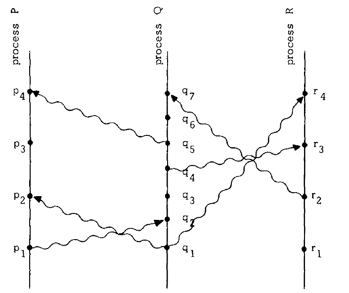
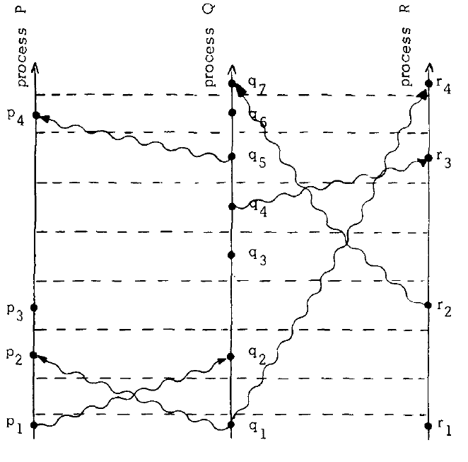

# Time-Clocks-and-the-Ordering-of-Events-in-a-Distributed-System

## Introduce

时间的概念至关重要，它衍生于事件发生的顺序。如果一件事情发生于时钟读取3:15之后并且在3:16之前，我们就说它发生的时间是3:15。然而，在分布式系统中，我们必须重新看待这个概念。

在分布式系统中，有时我们不可能说出两件事情中哪一件先发生。“先行发生(happened before)”关系仅仅表示系统中事件的偏序关系。

## The Partial Ordering

很多人可能会说如果事件a比事件b发生在一个更早的时间点，那么事件a比事件b先发生。他们会用物理学的事件来证明。
然而，如果系统正确地满足规范，则必须根据系统内可观察到的事件来给出该规范。如果这个规范是物理时间，那么系统必须包含真实的时钟。即使它真的包含真实的时钟，还是会有一些问题，这样的时钟并非完全准确，不能保证精确的物理时间。我们将不使用物理时间来定义“先行发生”关系。

我们假设系统由一些进程组成，每个进程由一系列事件组成。我们假设系统中的事件组成一个序列，如果a先行发生于b那么在这个序列中a发生于b之前。

我们假设发送或接收消息是流程中的事件。 如下，我们可以定义“先行发生”关系，用“--->”表示。

系统事件集上的关系“--->”是满足以下三个条件的最小关系：**（1）如果a和b是同一进程中的事件，并且a在b之前，则a ---> b。 （2）如果a是一个进程发送的消息，而b是另一个进程接收的同一消息，则a ---> b。 （3）如果a ---> b并且b ---> c，则a ---> c。 如果a -/-> b并且b -/-> a，则两个不同的事件a和b称为并发。**

并且对于任意a，满足 a -/-> a。这意味着 --> 是系统中所有事件集合的非自反偏序。

举例如下图，我们可以得到 p1 --> r4。

从另外一个角度来看，a ---> b也意味着可能事件a因果影响事件b（it is possible for event a to causally affect event b. ）。如果两个事件互不影响那么就是并发的。举例上图，p3和q3就是并发的，尽管q3发生的物理时间比p3更早，但是进程P无法得知进程Q在q3时间点做了什么，直到在q4时间点接收了消息。

## Logical Clocks

从一个抽象的观点开始，时钟只是为事件分配数字的一种方式，数字可以认为是事件发生的时间。

我们为每个进程Pi定义一个方法Ci()，对于这个进程中的任意事件a，分配一个数字Ci(a)。

我们认为Ci是逻辑时钟而不是物理时钟，可以用计数器来实现，而不需要真实的时间策略。

我们现在考虑这样的时钟系统的正确性意味着什么。我们的定义并未基于物理时间，而是基于事件发生的顺序。

最严格、合理的条件是，如果一个事件a在另一个事件b之前发生，那么a应该比b发生的时间更早。 我们将这种情况更正式地定义如下规则。
> Clock Condition. For any events a, b: if a ---> b then C(a) < C(b).

请注意，我们不能期望反过来也成立，因为这意味着任何两个并发事件必须同时发生。

Clock Condition满足下列两个条件：

1. C1. 如果a和b是进程Pi中的事件，并且a在b之前，则Ci（a）< Ci（b）。
2. C2. 如果a是进程Pi发送消息，b是接收这个消息，则Ci（a）< Ci（b）。

再看上图，我们想象一个过程的时钟“滴答”通过每个数字，滴答声发生在过程的事件之间。例如，如果a和b是进程Pi中的连续事件，且Ci(a)= 4且Ci(b)= 7，则时钟滴答5、6和7在两个事件之间发生。

我们通过不同进程的所有类似编号的刻度线绘制一条虚线“tick line”。

如何实现满足Clock Condition。其中C1很简单：

* IR1.每个进程Pi在任何两个连续事件之间使Ci递增。

为了满足C2，我们需要每个消息m都包含一个时间戳Tm, 是消息发送的时间。一旦收到时间戳为Tm的消息，该进程必须b把时钟拨到Tm之后。

* IR2. (a)如果事件a是进程Pi发送消息m，则消息m包含时间戳Tm = Ci(a)。(b)在接收到消息m时，进程Pi将Ci设置为大于或等于其当前值并且大于Tm。
