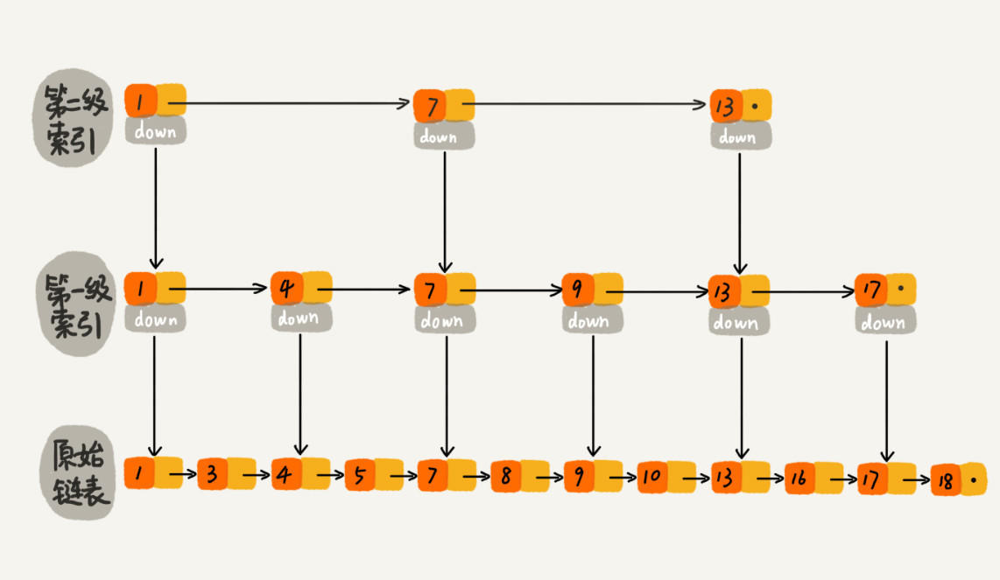

# 并发容器
## JDK 提供的并发容器总结
JDK提供的这些容器大部分在 java.util.concurrent 包中。
* ConcurrentHashMap: 线程安全的HashMap
* CopyOnWriteArrayList: 线程安全的List，在读多写少的场合性能非常好，远远好于Vector
* ConcurrentLinkedQueue: 高效的并发队列，使用链表实现。可以看做一个线程安全的 LinkedList，这是一个非阻塞队列
* BlockingQueue: 这是一个接口，JDK内部通过链表、数组等方式实现了这个接口。表示阻塞队列，非常适合用于作为数据共享的通道
* ConcurrentSkipListMap: 跳表的实现。这是一个Map，使用跳表的数据结构进行快速查找

## ConcurrentHashMap
在ConcurrentHashMap中，无论是读操作还是写操作都能保证很高的性能：在进行读操作时(几乎)不需要加锁，而在写操作时通过锁分段技术只对所操作的段加锁而不影响客户端对其它段的访问。

下面梳理一下关于 ConcurrentHashMap 比较重要的问题：
* [ConcurrentHashMap实现原理](https://blog.csdn.net/fjse51/article/details/55260493)

## CopyOnWriteArrayList
### CopyOnWriteArrayList 简介
```
public class CopyOnWriteArrayList<E>
    implements List<E>, RandomAccess, Cloneable, java.io.Serializable
```
在很多应用场景中，读操作可能会远远大于写操作。由于读操作根本不会修改原有的数据，因此对于每次读取都进行加锁其实是一种资源浪费。我们应该允许多个线程同时访问List的内部数据，毕竟读取操作是安全的。

相比 ReentrantReadWriteLock，CopyOnWriteArrayList 在读写锁的思想又更进一步。为了将读取的性能发挥到极致，CopyOnWriteArrayList 读取是完全不用加锁的，
并且更厉害的是：写入也不会阻塞读取操作。只有写入和写入之间需要进行同步等待。这样一来，读操作的性能就会大幅度提升。
### CopyOnWriteArrayList 原理浅析
CopyOnWriteArrayList 类的所有可变操作（add，set等等）都是通过创建底层数组的新副本来实现的。当 List 需要被修改的时候，并不修改原有内容，而是对原有数据进行一次复制，将修改的内容写入副本。
写完之后，再将修改完的副本替换原来的数据，这样就可以保证写操作不会影响读操作了。

从 CopyOnWriteArrayList 的名字就能看出CopyOnWriteArrayList 是满足CopyOnWrite 的ArrayList，所谓CopyOnWrite 也就是写时复制：
在计算机，如果你想要对一块内存进行修改时，我们不在原有内存块中进行写操作，而是将内存拷贝一份，在新的内存中进行写操作，写完之后呢，就将指向原来内存指针指向新的内存，原来的内存就可以被回收掉了。
### CopyOnWriteArrayList 关键源码
读取操作没有任何同步控制和锁操作，理由就是内部数组 array 不会发生修改，只会被另外一个 array 替换。
```
private transient volatile Object[] array;
private E get(Object[] a, int index) {
    return (E) a[index];
}
public E get(int index) {
    return get(getArray(), index);
}
```
CopyOnWriteArrayList 写操作的时候加了锁，保证了同步，避免了多线程写的时候会 copy 出多个副本出来。
```
public E set(int index, E element) {
    final ReentrantLock lock = this.lock;
    lock.lock();
    try {
        Object[] elements = getArray();
        E oldValue = get(elements, index);

        if (oldValue != element) {
            int len = elements.length;
            Object[] newElements = Arrays.copyOf(elements, len);
            newElements[index] = element;
            setArray(newElements);
        } else {
            // Not quite a no-op; ensures volatile write semantics
            setArray(elements);
        }
        return oldValue;
    } finally {
        lock.unlock();
    }
}
```
## ConcurrentLinkedQueue
Java提供的线程安全的 Queue 可以分为阻塞队列和非阻塞队列，其中阻塞队列的典型例子是 BlockingQueue，非阻塞队列的典型例子是ConcurrentLinkedQueue，在实际应用中要根据实际需要选用阻塞队列或者非阻塞队列。 
阻塞队列可以通过加锁来实现，非阻塞队列可以通过 CAS 操作实现。

ConcurrentLinkedQueue是一个基于链接节点的无界线程安全队列，它采用先进先出的规则对节点进行排序，当我们添加一个元素的时候，它会添加到队列的尾部，当我们获取一个元素时，它会返回队列头部的元素。
### 入队列
入队列就是将入队节点添加到队列的尾部。多个线程同时进行入队情况就变得更加复杂，因为可能会出现其他线程插队的情况。
```
public boolean offer(E e) {
    checkNotNull(e);
    // 创建一个线程安全的入队节点
    final Node<E> newNode = new Node<E>(e);

    for (Node<E> t = tail, p = t;;) {// p用来表示队列的尾节点，默认情况下等于tail节点。
        Node<E> q = p.next;
        if (q == null) {
            // p是尾节点，则设置p节点的next节点为入队节点
            if (p.casNext(null, newNode)) {
                if (p != t) 
                    /* 每两次更新一下tail:
                     * p != t 意味着tail节点被其他线程修改了，则将入队节点设置成tail节点
                     * 更新失败了也没关系，因为失败了表示有其他线程成功更新了tail节点
                     */
                    casTail(t, newNode);  // Failure is OK.
                return true;
            }
            // Lost CAS race to another thread; re-read next
        }
        else if (p == q)
            // 遇到哨兵节点，从head开始遍历
            //但是如果tail被修改，则使用tail
            p = (t != (t = tail)) ? t : head;
        else
            // 每两次更新后，确认tail更新
            p = (p != t && t != (t = tail)) ? t : q;
    }
}
```
参考[高效读写的队列：ConcurrentLinkedQueue](https://www.cnblogs.com/Joe-Go/p/9757394.html)

## BlockingQueue
### BlockingQueue 简单介绍
阻塞队列（BlockingQueue）被广泛使用在“生产者-消费者”问题中，其原因是BlockingQueue提供了可阻塞的插入和移除的方法。当队列容器已满，生产者线程会被阻塞，直到队列未满；当队列容器为空时，消费者线程会被阻塞，直至队列非空时为止。

BlockingQueue 是一个接口，继承自 Queue，所以其实现类也可以作为 Queue 的实现来使用，而 Queue 又继承自 Collection 接口。下面介绍一些 BlockingQueue 的相关实现类：
### ArrayBlockingQueue
ArrayBlockingQueue 是 BlockingQueue 接口的有界队列实现类，底层采用数组来实现。ArrayBlockingQueue一旦创建，容量不能改变。
其并发控制采用可重入锁来控制，不管是插入操作还是读取操作，都需要获取到锁才能进行操作。
当队列容量满时，尝试将元素放入队列将导致操作阻塞;尝试从一个空队列中取一个元素也会同样阻塞。

ArrayBlockingQueue 的可重入锁可以是公平的，也可以是非公平的。
如果保证公平性，通常会降低吞吐量。如果不保证公平性，可能会造成线程饥饿。
```
public ArrayBlockingQueue(int capacity, boolean fair) {
    if (capacity <= 0)
        throw new IllegalArgumentException();
    this.items = new Object[capacity];
    lock = new ReentrantLock(fair);
    notEmpty = lock.newCondition();
    notFull =  lock.newCondition();
}
```
### LinkedBlockingQueue
LinkedBlockingQueue 底层基于单向链表实现的阻塞队列，可以当做无界队列也可以当做有界队列来使用。
同样满足FIFO的特性，与ArrayBlockingQueue 相比起来具有更高的吞吐量，为了防止 LinkedBlockingQueue 容量迅速增长，损耗大量内存。
通常在创建LinkedBlockingQueue 对象时，会指定其大小，如果未指定，容量等于Integer.MAX_VALUE。
```
public LinkedBlockingQueue() {
    this(Integer.MAX_VALUE);
}
public LinkedBlockingQueue(int capacity) {
    if (capacity <= 0) throw new IllegalArgumentException();
    this.capacity = capacity;
    last = head = new Node<E>(null);
}
```
### PriorityBlockingQueue
PriorityBlockingQueue 是一个支持优先级的无界阻塞队列。默认情况下元素采用自然顺序进行排序，也可以通过自定义类实现 compareTo() 方法来指定元素排序规则，或者初始化时通过构造器参数 Comparator 来指定排序规则。

PriorityBlockingQueue 并发控制采用的是 ReentrantLock，队列为无界队列，初始默认大小为１１，后面插入元素的时候，如果空间不够的话会自动扩容。

简单地说，它就是 PriorityQueue 的线程安全版本。不可以插入 null 值，同时，插入队列的对象必须是可比较大小的（comparable），否则报 ClassCastException 异常。它的插入操作 put 方法不会 block，因为它是无界队列（take 方法在队列为空的时候会阻塞）。

## ConcurrentSkipListMap
先介绍一下跳表：
> 对于一个单链表，即使链表是有序的，如果我们想要在其中查找某个数据，也只能从头到尾遍历链表，这样效率自然就会很低，跳表就不一样了。
跳表是一种可以用来快速查找的数据结构，有点类似于平衡树。它们都可以对元素进行快速的查找。但一个重要的区别是：对平衡树的插入和删除往往很可能导致平衡树进行一次全局的调整。
而对跳表的插入和删除只需要对整个数据结构的局部进行操作即可。这样带来的好处是：在高并发的情况下，你会需要一个全局锁来保证整个平衡树的线程安全。
而对于跳表，你只需要部分锁即可。这样，在高并发环境下，你就可以拥有更好的性能。而就查询的性能而言，跳表的时间复杂度也是 O(logn) 所以在并发数据结构中，JDK 使用跳表来实现一个 Map。

跳表的本质是同时维护了多个链表，并且链表是分层的。
最低层的链表维护了跳表内所有的元素，每上面一层链表都是下面一层的子集。

跳表内的所有链表的元素都是排序的。查找时，可以从顶级链表开始找。一旦发现被查找的元素大于当前链表中的取值，就会转入下一层链表继续找。这也就是说在查找过程中，搜索是跳跃式的。

从上面很容易看出，跳表是一种利用空间换时间的算法。

使用跳表实现Map 和使用哈希算法实现Map的另外一个不同之处是：哈希并不会保存元素的顺序，而跳表内所有的元素都是排序的。
因此在对跳表进行遍历时，你会得到一个有序的结果。所以，如果你的应用需要有序性，那么跳表就是你不二的选择。
