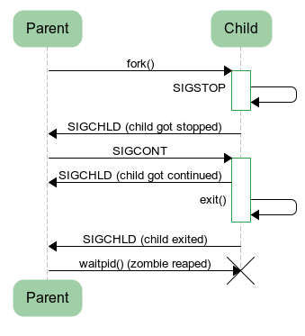

# Linux进程管理
## 查看进程
### ps：查看某时刻的进程信息
1. 查看自己的进程

    ```# ps -l```
2. 查看系统所有进程

    ```# ps aux```
2. 查看特定进程

    ```# ps aux | grep threadx```
### pstree：查看进程树
1. 查看所有进程树

    ```# pstree -A```
### top：实时显示进程信息
1. 2s刷新一次

    ```# top -d 2```
### netstat：查看占用端口的进程
1. 查看特定端口的进程

    ```# netstat -anp | grep port```
## 进程状态


|状态|说明|
|---|----|
|R|running or runnable(on run queue)|
|D|uninterruptible sleep(usually I/O)|
|R|interruptible sleep(waiting for an event to complete)|
|Z|zombie(terminated but not reaped by its parent)|
|T|stopped(either by a job control signal or because it is being traced)|

## SIGCHLD
当一个子进程改变其状态时（停止运行、继续运行或者退出），有两件事会发生在父进程中，
1. 收到SIGCHLD信号
2. waitpid()或者wait()调用会返回

其中子进程发送的SIGCHLD信号包含了子进程的信息，比如进程ID、进程状态、进程使用CPU的时间等。

在子进程退出时，它的进程描述符不会被立即释放，这是为了让父进程得到子进程的信息，父进程通过waitpid()和wait()
来获得一个已经退出的子进程的信息。



注：SIGCONT：Continue if stopped；SIGSTOP：Stop process.

## wait()
```
pid_t wait(int *status)
```
父进程调用wait()会一直阻塞，直到收到一个子进程的SIGCHLD信号，之后wait()函数会销毁子进程并返回。

如果成功，返回被收集的子进程的进程ID，如果调用进程没有子进程，调用就会失败，此时返回-1，同时error被置为ECHILD。

参数status用来保存被收集的子进程退出时的一些状态信息，如果对这个子进程是如何死掉的毫不在意，只想把这个子进程消灭掉，可以设置这个参数为 NULL。
## waitpid()
```pid_t waitpid(pid_t pid, int *status, int options)```
作用于wait()函数完全相同，但是多了两个可由用户控制的参数pid和options。

pid参数是指一个子进程的ID，表示只关心这个子进程退出的SIGCHLD信号。如果pid=-1，那么和wait()相同，都是关心所有子进程退出的SIGCHLD信号。

options参数主要有WHOHANG和WUNTRACED两个选项，WHOHANG可以使waitpid()函数变成非阻塞的，也就是说它会立即返回，父进程可以继续执行其它任务。

## 孤儿进程
一个父进程退出，而它的一个或多个子进程还在运行，那么这些子进程将成为孤儿进程。

孤儿进程将被init进程(pid=1)收养，并由init进程对它们完成状态收集工作。

由于孤儿进程会被init进程收养，所以孤儿进程不会对系统造成危害。
## 僵尸进程
一个子进程的进程描述符在子进程退出时不会被释放，只有当父进程通过wait()和waitpid()获取了子进程信息后才会释放。
如果子进程退出，而父进程并没有调用wait()和waitpid()，那么子进程的进程描述符仍然保存在系统中，这种进程被称之为僵尸进程。

僵尸进程通过ps命令显示出来的状态为Z（Zombie）。

系统所能使用的进程号是有限的，如果产生大量僵尸进程，将因为没有可用的进程号而导致系统不能产生新的进程。

要消灭系统中大量的僵尸进程，只需要将其父进程杀死，此时僵尸进程就会变成孤儿进程，从而被init进程所收养，这样init进程就会释放所有的僵尸进程
所占用的资源，从而结束僵尸进程。

参考[https://github.com/CyC2018/CS-Notes/blob/master/notes/Linux.md](https://github.com/CyC2018/CS-Notes/blob/master/notes/Linux.md)