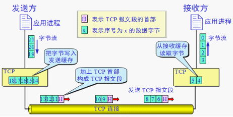
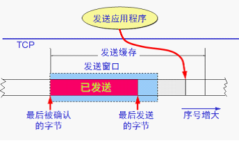
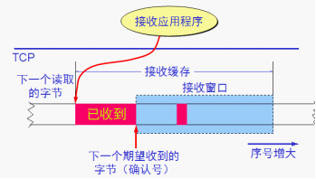
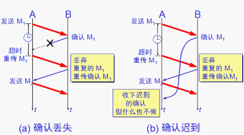
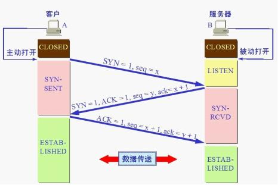
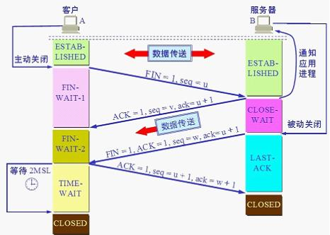
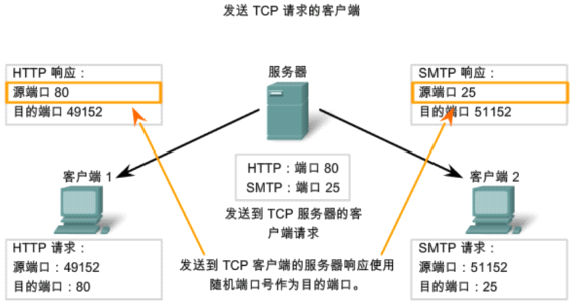
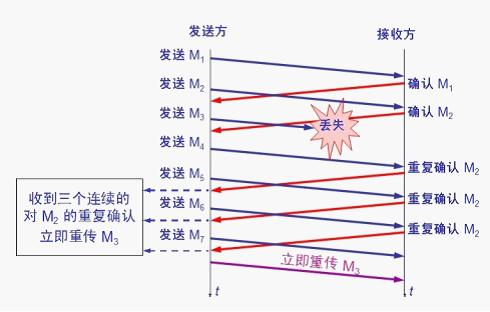
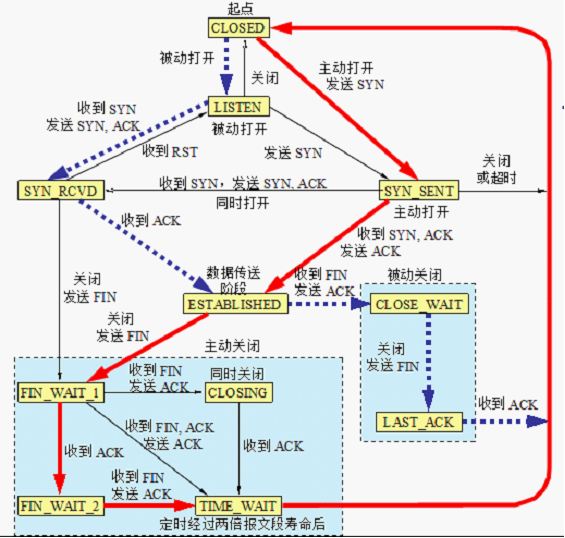

# TCP协议
## 首部格式
如图，

字段说明：
* 源端口、目的端口，各占2字节
* 序号，占4字节，TCP的数据流中每一个字节都有序号，序号值是指本报文段发送数据的第一个字节的序号
* 确认号，占4字节是期望收到对方下个报文段的数据的第一个字节的序号
* 数据偏移/首部长度，占4位，指TCP报文段数据起始处距离TCP报文段起始处有多远
* 保留，占6位，保留为以后使用，目前置为0
* URG，当URG=1时，表明紧急指针字段有效，表示此报文段有紧急数据，应尽快传送
* ACK，当ACK=1时，确认号字段才有效
* PSH，当PSH=1时，要尽快将此报文段传给应用程序，而不是等缓存区满了再传
* RST，当RST=1时，表明TCP连接出现严重差错，必须释放连接，然后重建
* SYN，当SYN=1时，表明这是一个连接请求或连接接收请求
* FIN，当FIN=1时，表明后续不再发送数据，并请求断开连接
* 窗口，TCP滑动窗口大小，告知对方自己能够接收的数据量
* 检验和，占2字节，检验和字段检验的范围包括首部和数据
* 紧急指针，占2字节，指明本报文段中紧急数据共有多少字节，紧急数据放在报文数据最前面
* 选项，TCP最初只规定了一种选项，即最大报文段长度MSS：缓存所能接收的报文段的数据字段的最大程度是MSS个字节（Maximum Segment Size）
* 填充，使整个首部长度是4字节的整数倍
* 其它选项：
    1. 窗口扩大，占3字节，其中有一个字节表示移位值S。新的窗口值等于TCP 首部中的窗口位数增大到(16 + S),相当于把窗口值向左移动 S 位后获得实际的窗口大小
    2. 时间戳，占10字节，其中最主要的字段时间戳值字段（4字节）和时间戳回送回答字段（4字节）

## 特点
* TCP是面向连接的传输层协议
* 每一条TCP连接只能用两个端点，每一条TCP连接只能是点到点
* TCP是可靠传输协议
* TCP提供全双工通信
* 面向字节流

## 注意
* TCP对应用程序一次发送多大的报文到TCP缓存是不关心的
* TCP根据对方给出的窗口值和当前网络拥塞的程度来决定一个报文段应当包含多少个字节（UDP发送的报文长度是应用进程给的）
* TCP可以把太长的数据块划分短一点再传送，也可以累积了足够多的字节再构成报文段发送出去
* TCP连接的端点不是主机，不是主机的ip地址，不是应用进程，也不是传输层的协议端口，而是套接字（socket）

## 自动重传请求（ARQ Automatic Repeat reQuest）
可靠传输协议常常被称为自动重传请求。

**累计确认**，接收方一般采用累计确认的方式，即不必对每个分组都发送确认而是对按序到达的最后一个分组发送确认，也就是说，此分组之前的所有分组都已经正确接收。
* 优点，容易实现，即使确认丢失也不必重传
* 缺点，不能向发送方反映出接收方已经正确收到的所有分组的信息

GO-BACK-N（回退N）：如果发送方发送了5个分组，第3个分组丢失了，这时接收方只能对前2个分组确认，发送方无法知道后3个分组的情况，所有要重传后3个分组。

## 具体实现
* TCP连接的两端都必须分别维护两个窗口：发送窗口和接收窗口
* TCP可靠传输机制用字节的序号进行控制，TCP所有的确认都是基于序号而不是报文段
* TCP两端的四个窗口经常会变化
* TCP连接的往返时间RTT也不是固定不变的，需要使用特定的算法估算较为合理的重传时间

## 发送缓存
发送缓存里有两种数据，
* 发送应用程序传送给发送TCP准备发送的数据
* TCP已发出但尚未收到确认的数据

## 接收缓存
发送缓存里也有两种数据，
* 按序到达，尚未被接收应用程序读取的数据
* 不按序到达的数据

## 确认丢失和确认迟到

## 运输连接
### 三次握手

三次握手需要达到一些目的，
* 要使双方都能感知到对方的存在
* 要允许双方协商一些参数（如最大报文段长度、最大窗口大小、服务质量等）
* 能够对运输实体资源（如缓存大小、连接表中的项目等）进行分配
### 四次挥手

**注意**：TCP连接必须经过时间2MSL后才真正释放掉---为了保证A发送的最后一个ACK报文段能够到达B，经过2MSL后，就可以使本连接持续的时间内所产生的所有报文段，都从网络中消失。
这样就可以使下一个新的连接中不会出现这种旧的连接请求报文段。
> MSL(Maximum Segment Lifetime), 这是一个IP数据包能在互联网上生存的最长时间，超过这个时间IP数据包将在网络中消失。

## 发送TCP请求

## 拥塞控制
### 拥塞窗口
拥塞大小的窗口取决于网络的拥塞程度，并且可以动态改变，发送方让发送窗口等于拥塞窗口，如再考虑到接收方的接收能力，则发送窗口还可能小于拥塞窗口。

只要网络没有出现拥塞，拥塞窗口就再增大一些，以便把更多的分组发送出去，但只要网络出现拥塞，拥塞窗口就减小一些，以减少发送到网络的分组数。
### 乘法减小
是指无论在慢启动阶段还是拥塞避免阶段，只要出现一次超时，就把慢启动门限值ssthresh设置为当前的拥塞窗口 * 0.5。
### 加法增大
是指执行拥塞避免算法后，在收到对所有报文段的确认后（即经过一个往返时间），就把拥塞窗口cwnd增加一个MSS大小，使拥塞窗口缓慢增大，以防止网络过早出现拥塞。
### 快重传
快重传算法要求接收方每收到一个失序的报文段就立即发送重复确认。这样可以让发送方及早知道有报文段丢失了，发送方只要一连接收到3个重复确认就应当立即重传对方尚未收到的报文段。

### 快恢复
当发送方收到连续3个重复确认，就执行乘法减小算法，把慢启动门限值ssthresh减半，但接下来不执行慢启动
### 发送窗口的上限值
发送方的发送窗口上限值应当取为接收方窗口rwnd和拥塞窗口cwnd较小的一个。
## 拥塞控制具体实现
### 慢启动算法
1. 在主机刚刚开始发送报文段时可先设置拥塞窗口cwnd=1，即设置为一个最大报文段MSS的数值
2. 在每收到一个对新报文段的确认后，将拥塞窗口+1，即增加MSS的数值
3. 使用慢启动算法后，每经过一次传输（往返时间RTT），拥塞窗口cwnd就加倍
### 拥塞避免算法
拥塞窗口cwnd缓慢的增大，每经过一次传输（往返时间RTT），将发送方拥塞窗口cwnd+1
### 慢启动门限值ssthresh
1. 当cwnd < ssthresh，使用慢启动算法
2. 当cwnd > ssthresh，使用拥塞避免算法
3. 当cwnd = ssthresh，两种都可以使用
### 网络出现拥塞时（超时）
1. 就要把慢启动门限值ssthresh设置为此时发送方窗口值的一半，但不能小于2
2. 然后把拥塞窗口cwnd重新设置为1，执行慢启动算法

### TCP有限状态机
如图说明，
1. 每一个方框都是 TCP 可能具有的状态
2. 每个方框中的大写英文字符串是 TCP 标准所使用的 TCP 连接状态名.状态之间的箭头表示可能发生的状态变迁
3. 箭头旁边的字,表明引起这种变迁的原因,或表明发生状态变迁后又出现什么动作
4. 三种不同的箭头，
   * 粗实线箭头表示对客户进程的正常变迁
   * 粗虚线箭头表示对服务器进程的正常变迁
   * 另一种细线箭头表示异常变迁
   

## 相关面试题
### 为什么建立连接需要三次握手，而断开连接需要四次握手
因为TCP是全双工协议，所以每个方向必须单独关闭，每个方向都需要一个FIN和一个ACK。当一端发送了FIN包之后，处于半关闭状态，仍然能够接收数据。

在握手时，服务器可以把SYN和ACK放在一个包里发送。但是挥手时，如果一端收到FIN包，但此时数据还没有发送完，就需要先回复对方FIN的ACK，
然后将自己的数据发送完，再发送FIN取断开连接。通常FIN和ACK需要在两个包里发送，所以需要四次挥手。

### TIME_WAIT状态持续时间及原因 
持续时间是2MSL，一个数据包在网络中的最长生存时间为2MSL。

假设客户端最后回复的ACK丢失，服务端会在超时后重传FIN。ACK和FIN在网络中的最长生存时间就为2MSL，这样就可以可靠的断开TCP的双向连接。

### TCP在listen时的参数backlog的意义
Linux内核会维护两个队列。
1. 未完成队列，接收到一个SYN建立连接请求，处于SYN_RCVD状态
2. 已完成队列，已完成TCP三次握手，处于ESTABLISHED状态

当有一个SYN到来请求建立连接时，就在未完成队列中新建一项。当三次握手过程完成后，就将套接口从未完成队列移动到已完成队列。 backlog是两个队列总和的最大值。

### 三次握手过程中有哪些不安全性
1. SYN泛洪攻击：伪装的IP向服务器发送一个SYN请求建立连接，然后服务器向该IP回复SYN和ACK，但是找不到该IP对应的主机，当超时时服务器收不到ACK会重复发送。
当大量的攻击者请求建立连接时，服务器就会存在大量未完成三次握手的连接，服务器主机backlog被耗尽而不能响应其它连接。
    
    防范措施，
    * 降低SYN timeout时间，使得服务器尽快释放半连接的占用
    * 采用SYN cookie设置，如果短时间内连续收到某个IP的重复SYN请求，则认为受到了该IP的攻击，丢弃来自该IP的后续请求报文 
    * 在网关处设置过滤，拒绝将一个源IP地址不属于其来源子网的包进行更远的路由
2. 当一个主机向服务器发送SYN请求连接，服务器回复ACK和SYN后，攻击者截获ACK和SYN。然后伪装成原始主机继续与服务器进行通信。

参考：[http://www.cnblogs.com/kzloser/articles/2582957.html](http://www.cnblogs.com/kzloser/articles/2582957.html)