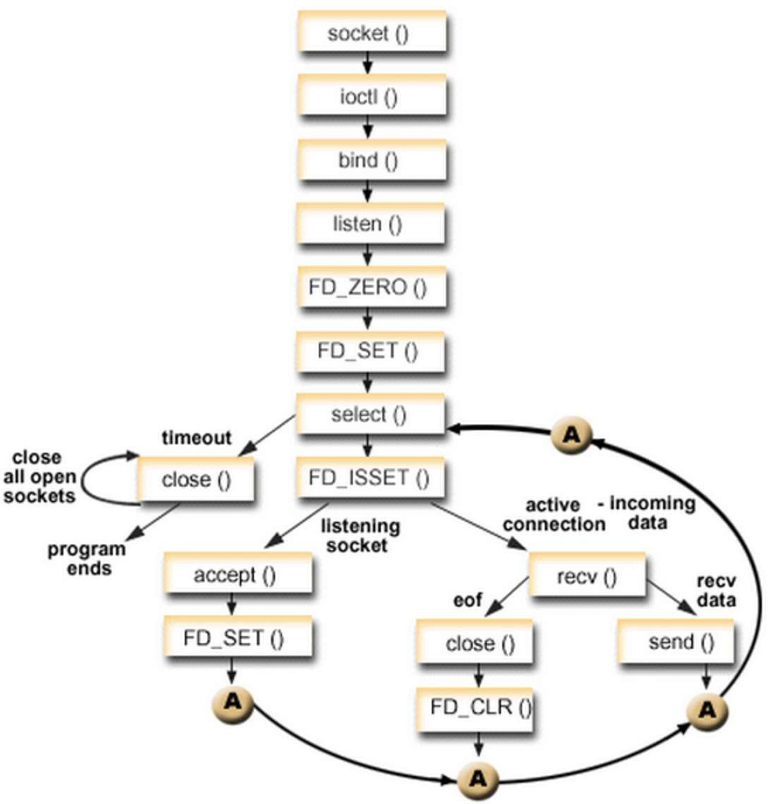

# select、poll、epoll系统调用
目前支持I/O多路复用的系统调用有select、poll、epoll。I/O多路复用就是通过一种机制，一个进程可以描述监听多个描述符，一旦某个描述符就绪（读/写就绪），
能够通知程序进行相应的读写操作。但是select、poll、epoll本质上都是同步I/O，因为它们都需要在读写事件继续后自己负责读写，也就是说这个读写过程是阻塞的。
而异步I/O则无需自己负责读写，异步I/O的实现会负责把数据从内核拷贝到用户空间。

## select、poll、epoll简介
### select
1. 基本原理
    
   select函数监听的文件描述符有3类：writefds、readfds和exceptfds。调用后select函数会阻塞，直到有描述符就绪，或者超时（timeout指定等待时间，如果立即返回设为null即可），
   函数返回。然后可以遍历fdset，来找到就绪的描述符。
2. 基本流程

   
   select目前几乎在所有的平台上支持，其良好跨平台支持也是它的一个优点。
   
select本质上是通过设置或检查存放fd标志位的数据结构来进行下一步处理，这样导致一些问题：
* select最大缺陷就是单个进程所打开的fd是有一定限制的，它由FD_SETSIZE设置，默认值是1024。一般来说这个数目和系统内存关系很大，具体数目可以cat /proc/sys/fs/file-max察看。32位机默认是1024个。64位机默认是2048。
* 采用线性扫描的方式对socket进行扫描，效率较低。当套接字比较多的时候，每次调用都需要遍历所有的socket，这回浪费很多CPU时间。下文提到的epoll采用回调机制，节约CPU资源。
* 需要维护一个用来存放大量fd的数据结构，这样会使得用户空间和内核空间在传递该结构时复制开销大。

### poll
1. 基本原理
   
   poll本质上和select没有什么区别，它将用户传入的数组拷贝到内核空间，然后查询某个fd的状态，如果就绪则加入队列并继续遍历。如果遍历完所有fd后没有发现就绪fd，
   则挂起当前进程，直到fd就绪或者超时，被唤醒后又要遍历fd。这个过程经历了多次无谓的遍历。

poll没有最大fd数量的限制，原因是它基于链表来存储的，但是同样有缺点：
* 大量fd的数组被整体复制于用户空间和内核空间，而不管这样的复制是不是有意义。

poll还有一个特点是水平触发，如果报告了fd，没有被处理，那么下次还会报告该fd。

从上面看，select和poll都需要在返回后，通过遍历fd来获取已经就绪的socket。事实上，同时连接的大量客户端在一时刻可能只有很少的处于就绪状态，因此随着监听的描述符数量的增长，其效率也会线性下降。

### epoll
epoll是之前select和poll的增强版本，更加灵活，没有fd数量限制。epoll使用一个文件描述符管理多个描述符，将用户关心的文件描述符的事件存放到内核的一个事件表中，这样在用户空间和内核空间只需复制一次。

1. 基本原理

   epoll支持水平触发和边缘触发，重点在于边缘触发，它只告诉进程哪些fd刚刚变为就绪，并且只会通知一次。还有一个特点，epoll采用“事件”的就绪通知方式，
   通过epoll_ctl注册fd，一旦该fd就绪，内核就会采用类似callback的回调机制来通知该fd，epoll_wait就会收到通知。

2. 优点
   
   * 没有最大并发连接的限制，能打开的fd上限远大于1024（1G的内存上能监听约10万个端口）。
   * 基于回调机制通知进程，效率不会随着fd数目的增加而下降。只有活跃可用的fd才会调用callback函数，即epoll最大的优点就在于它只管你“活跃”的连接，而跟连接总数无关，
   因此在实际的网络环境中，epoll的效率就会远远高于select和poll。
   * 内存拷贝，使用文件内存映射加速与内核空间的消息传递
   
epoll的文件描述符的操作有两种模式：LT（level trigger）和ET（edge trigger）。LT是默认模式，二者区别如下，
* LT模式：同时支持block和no-block socket。当epoll_wait检测到描述符事件发生并将此事件通知应用程序，应用程序可以不立即处理该事件。下次调用epoll_wait时，会再次将此事件通知应用程序。
* ET模式：仅支持no-block socket。当epoll_wait检测到描述符事件发生并将此事件通知应用程序，应用程序必须立即处理该事件。如果不处理，下次调用epoll_wait时，不会再次通知该事件。

注意：如果没有大量的idle-connection或者dead-connection，epoll的效率并不会比select/poll高很多，但是当遇到大量的idle-connection，就会发现epoll的效率大大高于select/poll。